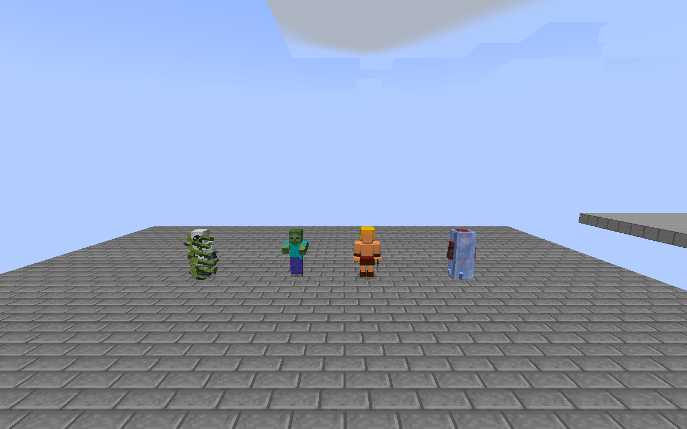

# 皇室法术 · Royale Spells

把皇室战争的法术带进 **Minecraft Java 1.21.1 / NeoForge**。

当前版本 **1.2.0**：28 张法术卡牌与野蛮人小屋，原版卡图、圣水、觉醒、召唤物和独立法术效果。

Clash Royale inspired spells and a Barbarian Hut for Minecraft Java 1.21.1, built with NeoForge, with optional Iron's Spells combat compatibility.

## 下载与安装

本分支是 **Minecraft 1.21.1 NeoForge 版**，保留 1.2.0 的 29 张卡牌、模型、原版音效和 26 场录制地图。

| Minecraft | 加载器 | 下载 |
| --- | --- | --- |
| 1.20.1 | Fabric | [1.2.0 发布页](https://github.com/bendy17323333-lang/royale-spells-fabric/releases/tag/v1.2.0) |
| 1.21.1 | Fabric | [1.2.0 发布页](https://github.com/bendy17323333-lang/royale-spells-fabric/releases/tag/v1.2.0-mc1.21.1) |
| 1.21.1 | NeoForge | [本版本发布页](https://github.com/bendy17323333-lang/royale-spells-fabric/releases/tag/v1.2.0-neoforge-mc1.21.1) |

本版本需要 **Java 21** 和 **NeoForge 21.1.200 或更新的 21.1.x**，实际验证使用 **21.1.249**。从 [发布页](https://github.com/bendy17323333-lang/royale-spells-fabric/releases/tag/v1.2.0-neoforge-mc1.21.1) 下载：

- `royale-spells-neoforge-1.21.1-1.2.0.jar`：模组本体，放入 NeoForge 实例的 `mods`。
- `royale-spells-1.2.0-neoforge-1.21.1.zip`：本体、说明、预览和录制地图合集。
- `royale-spells-1.2.0-neoforge-mc1.21.1-recording-map.zip`：独立录制／测试地图。
- `royale-spells-1.2.0-neoforge-mc1.21.1-source.zip`：完整源码、资源和可编辑模型。

本体可独立安装，不需要 Fabric API 或铁魔法。升级时退出游戏，替换旧 JAR；同一实例只保留一个加载器版本。联机时服务端和每位玩家均需安装本模组。

## 与铁魔法同装

已验证 [Iron's Spells 'n Spellbooks 1.21.1-3.16.3](https://www.curseforge.com/minecraft/mc-mods/irons-spells-n-spellbooks) 及其依赖：GeckoLib 4.9.2、playerAnimator 2.0.4、Curios 9.5.1、Iron's Lib 1.21.1-2.1.0。使用 CurseForge／Modrinth 安装铁魔法时一并安装它声明的依赖。

- 同一主人和同队的双方召唤物会识别为友军；皇室攻击法术排除己方铁魔法召唤物，辅助法术识别它们。
- 敌方召唤物能相互选敌、近战，双方法术能正常造成伤害；保留铁魔法的伤害事件及命中后效果。
- 冻结会暂停铁魔法生物的 AI 和正在进行的施法计时，解除后恢复；冰壳、藤蔓支持其 GeckoLib 模型。
- 飓风和雪球能移动铁魔法测试对象；地震尊重 NeoForge 方块保护事件，死亡取消不会提前触发诅咒召唤。
- 皇室卡牌继续使用自己的圣水体系；本版没有加入铁魔法的法术书、卷轴或魔力体系。



## 怎么玩

创造模式在 **皇室卡牌** 物品组取卡，手持卡牌瞄准后右键施放。生存模式使用无序配方制作卡牌，卡牌可以反复使用。

圣水上限 10，每两秒恢复 1 点；创造模式免圣水消耗。镜像复制上一张卡，保留觉醒效果，并将伤害、治疗及召唤物属性提高约 10%。

管理员或开启作弊后可以使用：

```mcfunction
/royalespells give
/royalespells give barbarian_hut
/royalespells refill
/royalespells clear
```

全部卡牌、配方和适配数值见 [中文使用说明](README-zh_CN.md)。

## 法术与召唤物

- 包含火球、火箭、Zap、雷电、滚木、墓园、毒药、狂暴、冰冻、克隆、镜像、虚空、地震、藤蔓等 28 张法术卡，包含觉醒与历史／活动变体。
- 卡牌图标使用皇室战争原版卡图；哥布林召唤物改为小僵尸。
- 墓园使用经典原版登场音效，召唤持石剑、6 点生命的原版骷髅；每击基础伤害 1.5，多只骷髅的攻击可分别命中。
- 野蛮人使用定制金发、长胡子模型及原版角色音效；野蛮人小屋定时出兵。
- 克隆体为青色半透明，狂暴呈紫色染色，冰冻有冰壳，藤蔓有立体缠绕模型。
- 地震的三次震荡累积方块裂纹，第三次破坏木材、让石材保留 90% 进度约 5 秒；可在此期间继续施法破坏石材。


## 1.2.0 更新

- 重做小电动态：下降先导、分叉电弧、闪烁和消散，电弧连接实际命中的目标。
- 普通小电／觉醒首击半径 2.2 格，觉醒第二击 3 格；万箭齐发 4.5 格，火球 2.8 格。
- 修正野蛮人握剑位置；皇家卫队换为原作风格的木桶头盔、蓝色羽毛、钢甲、木盾与凉鞋。
- 地震改为三次累积破坏，短暂保留裂纹；飓风、雪球等推拉能实际移动关闭 AI 的目标，并保留墙体碰撞。
- 新增 26 个演示场景，排除治疗和温暖。快捷栏羽毛切上一场、烈焰棒切下一场，潜行使用重置当前场景。详见 [录制地图说明](docs/recording-map.md)。

下载地图 ZIP，解压后把包含 `level.dat` 的「皇室法术-录制片场-1.2.0-MC1.21.1-NeoForge」文件夹放进实例的 `saves`。安装 1.2.0 模组后，在单人游戏中打开「皇室法术 · 录制片场 1.2.0 (MC 1.21.1 NeoForge)」。第 8 格羽毛右键上一场，第 9 格烈焰棒右键下一场；潜行右键任一控制物品可重置场景。


## 1.1.2 更新

- 火箭头部沿实际弹道转动，上升抬头、顶点转平、下落俯冲；尾焰和烟从尾部喷出。
- 重做野蛮人脸型、眉眼、金发和长马蹄形胡子，调整身体轮廓与服饰，铁剑跟随真实手部动作。
- 脚步只播放原作无喊声版本，降低音量并限制频率；攻击语音仍由实际攻击触发。


## 从源码构建

构建和游戏运行均使用 **JDK / Java 21**：

```powershell
./gradlew.bat build
./gradlew.bat runGameTestServer
./gradlew.bat runVisualSmoke
./gradlew.bat runShowcase
```

Linux / macOS 使用 `./gradlew`。无 `sources` 后缀的安装 JAR 位于 `build/libs`。

可选同装测试：把上述铁魔法及依赖 JAR 放入一个独立目录，运行 `./gradlew.bat runCompatGameTest runCompatVisual -PcompatModsDir=目录路径`。这些依赖不会打入发布 JAR。独立安装有 38 项 GameTest；同装后有 46 项，包含 8 项专门的铁魔法交互测试。

`runVisualSmoke` 会启动开发客户端，在工程自己的目录创建新测试世界并截图，完成后自动关闭。需要可用的图形环境；普通游戏不会启用该流程。游戏不会通过这个任务打开已有正式存档。

`art/make-troop-models.py` 是几何生成器，`art/blockbench` 包含可编辑的模型工程。野蛮人网格的顶点配色由游戏渲染器应用，导出工程保留对应元数据。

## 验证与素材

NeoForge 适配与验证记录见 [验证说明](docs/validation-neoforge-1.21.1.md)。其他验证文档保留为对应 Fabric 版本的历史记录。

本项目为玩家制作的非官方模组。皇室战争卡图与音效属于原权利人，素材来源、原始哈希和生成提示词见 [ASSETS.md](ASSETS.md)、各项 `*-SOURCES.json` 及 [TROOP-ASSETS.json](TROOP-ASSETS.json)。本仓库尚未为项目代码另行指定开源许可证。
