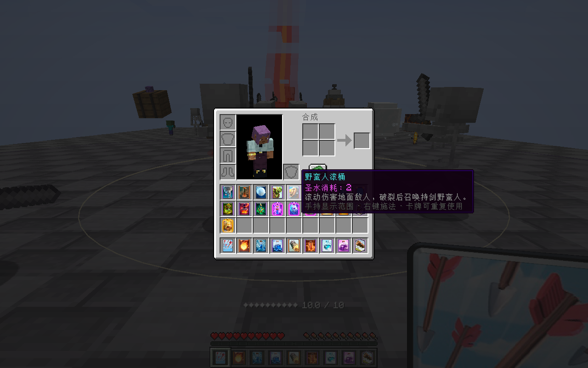
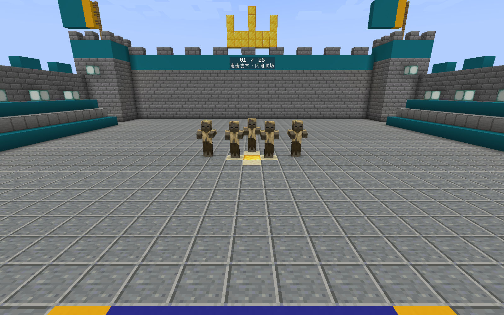
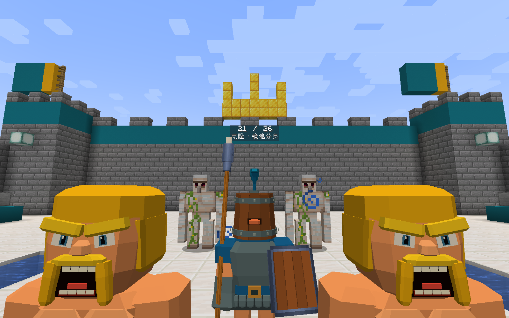
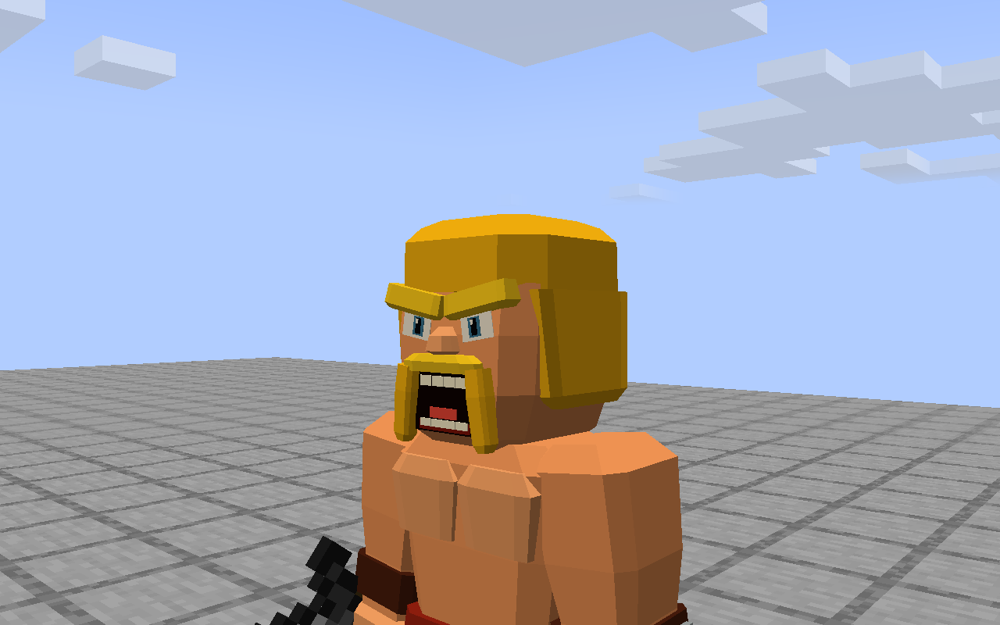
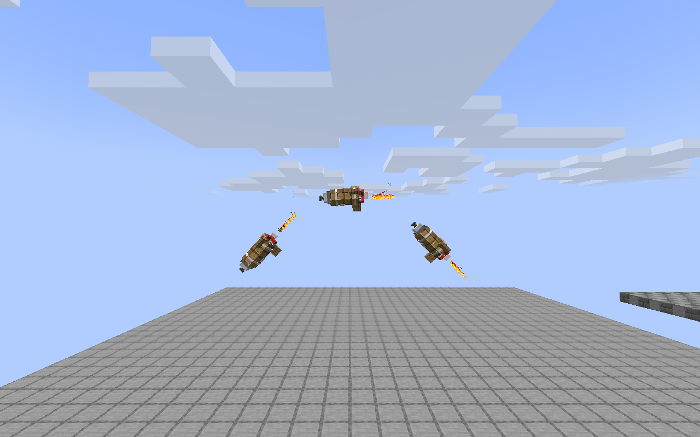
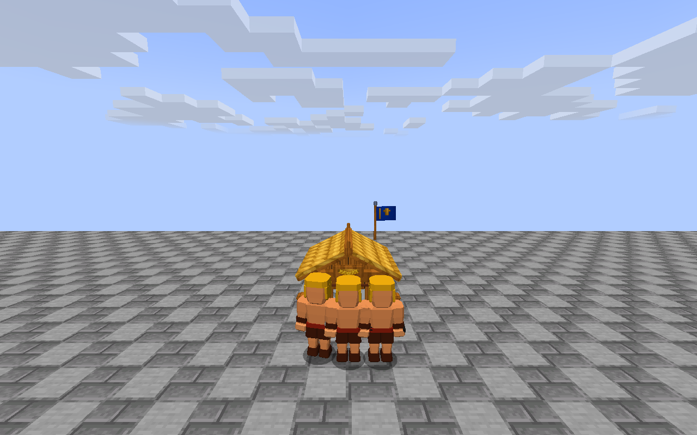

# 皇室法术 · Royale Spells

把皇室战争的法术带进 **Minecraft Java 1.20.1 / Fabric，以及 1.21.1 / Fabric、NeoForge**。

最新铁魔法适配版为 **1.5.2-beta.1（Beta 1）**，适用于 **Minecraft 1.21.1 / NeoForge**，已接入铁魔法的学派、稀有度、等级、魔力、卷轴制作、抄写、法术书与武器施法，并加入圣水、暗黑重油和觉醒骷髅军团。这是铁魔法完整适配的首个公开预发布版。

Fabric 1.20.1、Fabric 1.21.1 和旧版 NeoForge 同装适配分支目前仍为 **1.2.0**，包含 28 张法术卡牌与野蛮人小屋。各版本的下载入口见下表。

Clash Royale inspired spells for Minecraft Java 1.20.1 (Fabric) and 1.21.1 (Fabric / NeoForge). The latest NeoForge Iron's Spells integration is **1.5.2-beta.1**, with native spellbook, mana, scroll crafting and progression support; the Fabric releases remain at **1.2.0**.

## 开发技术档案

[完整中文技术档案 · 铁魔法 Beta 1](https://github.com/bendy17323333-lang/royale-spells-fabric/blob/iron-integration-1.21.1/docs/technical/README.md) 已按 `1.5.2-beta.1` 源码整理，覆盖架构、施法数值、铁魔法系统、召唤 AI、圣水与重油、结构与仪式、同步存档、特效模型、音频、构建测试和扩展流程。

可直接阅读 [准星渲染原理与故障修复](https://github.com/bendy17323333-lang/royale-spells-fabric/blob/iron-integration-1.21.1/docs/technical/03-target-preview.md)、[源码索引](https://github.com/bendy17323333-lang/royale-spells-fabric/blob/iron-integration-1.21.1/docs/technical/source-index.md) 和 [法术、音效与配方表](https://github.com/bendy17323333-lang/royale-spells-fabric/blob/iron-integration-1.21.1/docs/technical/spell-reference.md)。技术档案对应 NeoForge 铁魔法分支，旧 Fabric 分支的接口和数值应以各自源码为准。

## 下载与安装

**想体验铁魔法完整适配，请下载下表第一行的 Beta 1。** 它在 GitHub Releases 中标为 **Pre-release（预发布）**。

请按 Minecraft 版本、加载器和玩法选择，下载同一行对应的发布包：

| Minecraft | 下载 | Java | 源码分支 |
|---|---|---|---|
| **1.21.1 NeoForge** | **[1.5.2-beta.1 铁魔法完整适配 · Beta 1](https://github.com/bendy17323333-lang/royale-spells-fabric/releases/tag/v1.5.2-beta.1-neoforge-mc1.21.1)** | **21** | [iron-integration-1.21.1](https://github.com/bendy17323333-lang/royale-spells-fabric/tree/iron-integration-1.21.1) |
| 1.21.1 NeoForge | [1.2.0 旧版同装适配与地图](https://github.com/bendy17323333-lang/royale-spells-fabric/releases/tag/v1.2.0-neoforge-mc1.21.1) | 21 | [neoforge-1.21.1](https://github.com/bendy17323333-lang/royale-spells-fabric/tree/neoforge-1.21.1) |
| 1.21.1 Fabric | [1.2.0 适配版与新版地图](https://github.com/bendy17323333-lang/royale-spells-fabric/releases/tag/v1.2.0-mc1.21.1) | 21 | [mc-1.21.1](https://github.com/bendy17323333-lang/royale-spells-fabric/tree/mc-1.21.1) |
| 1.20.1 Fabric | [1.2.0 模组与地图](https://github.com/bendy17323333-lang/royale-spells-fabric/releases/tag/v1.2.0) | 17+ | main |

**Beta 1** 已验证与 **Iron's Spells 'n Spellbooks 1.21.1-3.16.3** 配合使用，共有 **30 种皇室法术（含召唤法术）**。支持卷轴制作、抄写、提取、奥术铁砧升级、镜像复制皇室及铁魔法法术，以及圣水和暗黑重油获取、卡牌觉醒、骷髅军团与号角仪式。安装依赖、玩法和测试记录见 [铁魔法 Beta 分支说明](https://github.com/bendy17323333-lang/royale-spells-fabric/tree/iron-integration-1.21.1)。

Beta 的安装文件是 `royale-spells-neoforge-1.21.1-1.5.2-beta.1.jar`。发布包还提供说明、源码、验证记录与校验文件；录制地图目前仍放在各个 **1.2.0** 发布条目中。

旧版 **NeoForge 1.2.0** 提供铁魔法同装与战斗兼容，使用独立圣水体系；该版本的说明见 [旧版 NeoForge 分支](https://github.com/bendy17323333-lang/royale-spells-fabric/tree/neoforge-1.21.1)。

以下安装文件、玩法、地图和构建说明对应本分支的 **1.20.1 Fabric 1.2.0** 版；铁魔法 Beta 和其它 **1.21.1** 版本请使用上表对应的发布条目及分支说明。同一实例只保留对应 Minecraft 版本和加载器的一份模组。

- `royale-spells-fabric-1.20.1-1.2.0.jar`：模组本体。
- `royale-spells-1.2.0-fabric-1.20.1.zip`：安装包，包含本体、Fabric API、说明与预览。
- `royale-spells-1.2.0-recording-map.zip`：26 场法术演示／测试地图。
- `royale-spells-1.2.0-source.zip`：完整源码、资源和可编辑模型。

需要 Minecraft **1.20.1**、Fabric Loader **0.16.14 或兼容的新版本**、对应 1.20.1 的 **Fabric API**，以及 **Java 17 或以上**。

退出游戏，将 JAR 放入对应实例的 `mods` 文件夹。升级时替换旧版，只保留一份本模组；已有兼容 Fabric API 时也只保留一份。联机时服务端和每位玩家都需要安装本模组与 Fabric API。

## 1.20.1 Fabric 版怎么玩

创造模式在 **皇室卡牌** 物品组取卡，手持卡牌瞄准后右键施放。生存模式使用无序配方制作卡牌，卡牌可以反复使用。

圣水上限 10，每两秒恢复 1 点；创造模式免圣水消耗。镜像复制上一张卡，保留觉醒效果，并将伤害、治疗及召唤物属性提高约 10%。

管理员或开启作弊后可以使用：

```mcfunction
/royalespells give
/royalespells give barbarian_hut
/royalespells refill
/royalespells clear
```

全部卡牌、配方和适配数值见 [中文使用说明](README-zh_CN.md)。

## 法术与召唤物

- 包含火球、火箭、Zap、雷电、滚木、墓园、毒药、狂暴、冰冻、克隆、镜像、虚空、地震、藤蔓等 28 张法术卡，包含觉醒与历史／活动变体。
- 卡牌图标使用皇室战争原版卡图；哥布林召唤物改为小僵尸。
- 墓园使用经典原版登场音效，召唤持石剑、6 点生命的原版骷髅；每击基础伤害 1.5，多只骷髅的攻击可分别命中。
- 野蛮人使用定制金发、长胡子模型及原版角色音效；野蛮人小屋定时出兵。
- 克隆体为青色半透明，狂暴呈紫色染色，冰冻有冰壳，藤蔓有立体缠绕模型。
- 地震的三次震荡累积方块裂纹，第三次破坏木材、让石材保留 90% 进度约 5 秒；可在此期间继续施法破坏石材。



## 1.2.0 更新

- 重做小电动态：下降先导、分叉电弧、闪烁和消散，电弧连接实际命中的目标。
- 普通小电／觉醒首击半径 2.2 格，觉醒第二击 3 格；万箭齐发 4.5 格，火球 2.8 格。
- 修正野蛮人握剑位置；皇家卫队换为原作风格的木桶头盔、蓝色羽毛、钢甲、木盾与凉鞋。
- 地震改为三次累积破坏，短暂保留裂纹；飓风、雪球等推拉能实际移动关闭 AI 的目标，并保留墙体碰撞。
- 新增 26 个演示场景，排除治疗和温暖。快捷栏羽毛切上一场、烈焰棒切下一场，潜行使用重置当前场景。详见 [录制地图说明](docs/recording-map.md)。

下载地图 ZIP，解压后把包含 `level.dat` 的「皇室法术-录制片场-1.2.0」文件夹放进实例的 `saves`。安装 1.2.0 模组后，在单人游戏中打开「皇室法术 · 录制片场 1.2.0」。第 8 格羽毛右键上一场，第 9 格烈焰棒右键下一场；潜行右键任一控制物品可重置场景。





## 1.1.2 更新

- 火箭头部沿实际弹道转动，上升抬头、顶点转平、下落俯冲；尾焰和烟从尾部喷出。
- 重做野蛮人脸型、眉眼、金发和长马蹄形胡子，调整身体轮廓与服饰，铁剑跟随真实手部动作。
- 脚步只播放原作无喊声版本，降低音量并限制频率；攻击语音仍由实际攻击触发。







## 从源码构建

构建使用 **JDK 21**，产物兼容 **Java 17**：

```powershell
./gradlew.bat build
./gradlew.bat runGametest
```

Linux / macOS 使用 `./gradlew`。无 `sources` 后缀的安装 JAR 位于 `build/libs`。

`runVisualSmoke` 会启动开发客户端，在工程自己的目录创建新测试世界并截图，完成后自动关闭。需要可用的图形环境；普通游戏不会启用该流程。游戏不会通过这个任务打开已有正式存档。

`art/make-troop-models.py` 是几何生成器，`art/blockbench` 包含可编辑的模型工程。野蛮人网格的顶点配色由游戏渲染器应用，导出工程保留对应元数据。

## 验证与素材

1.2.0 已通过 36 项 Minecraft GameTest、开发客户端与整合包副本中的 26 场地图检查，以及范围深度、模型、音效和火箭飞行回归。详见 [验证记录](docs/validation-1.2.0.md)。

本项目为玩家制作的非官方模组。皇室战争卡图与音效属于原权利人，素材来源、原始哈希和生成提示词见 [ASSETS.md](ASSETS.md)、各项 `*-SOURCES.json` 及 [TROOP-ASSETS.json](TROOP-ASSETS.json)。本仓库尚未为项目代码另行指定开源许可证。
