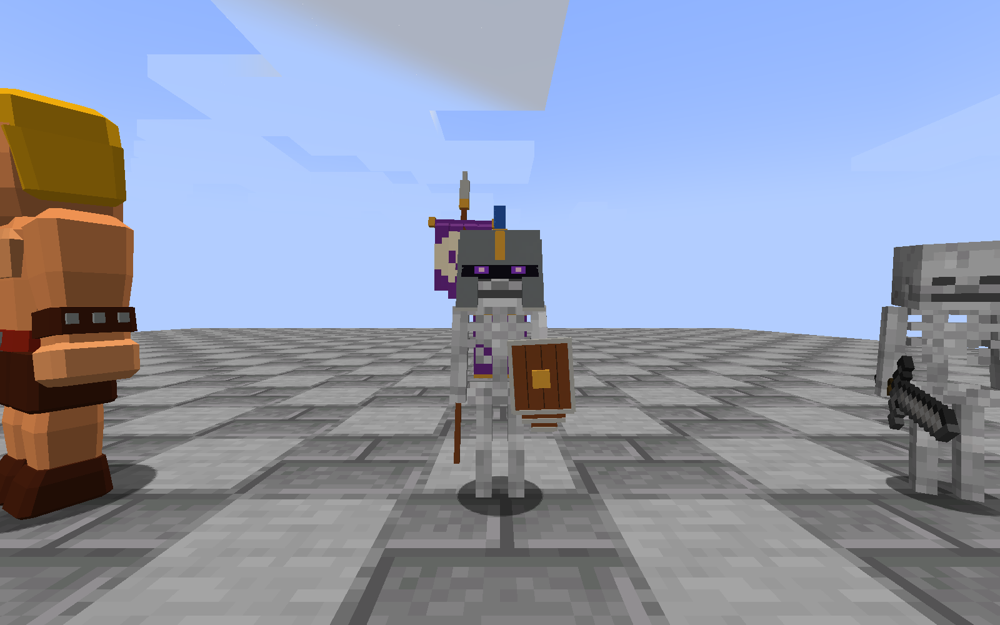
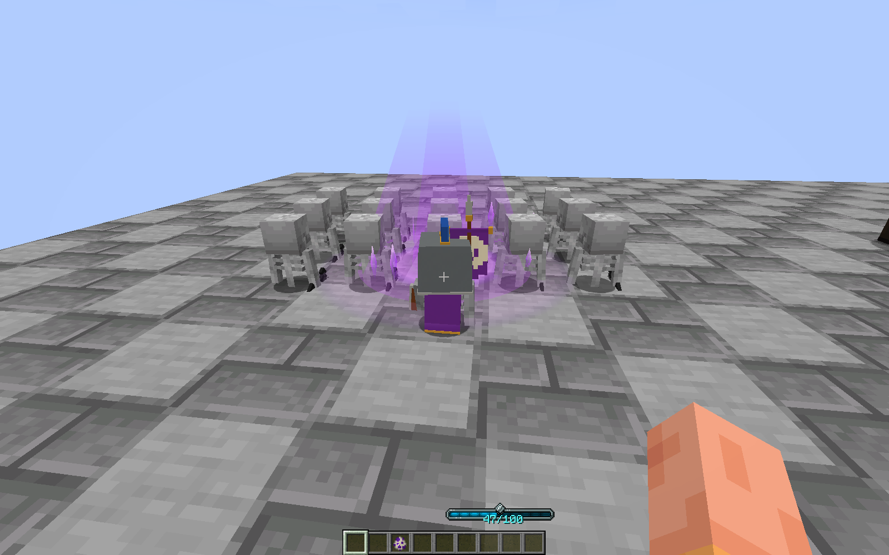

# 铁魔法适配 Beta 1 验证

Minecraft 1.21.1、NeoForge 21.1.249、Java 21，铁魔法 1.21.1-3.16.3 及依赖。版本 `1.5.2-beta.1`。

JAR `royale-spells-neoforge-1.21.1-1.5.2-beta.1.jar`，SHA-256：`c1a1d9c9486d44074f7ef06db10ba702de1d0b8a42b4f7c4797656ea1bcf772d`。

| 检查 | 结果 |
| --- | --- |
| Gradle build | 通过 |
| 不安装铁魔法的独立 GameTests | 51 / 51 |
| 铁魔法及依赖同装的 GameTests | 107 / 107 |
| 最终打包 JAR 的战斗客户端检查 | 通过 |
| 最终打包 JAR 的仪式与军团客户端检查 | 通过 |
| JAR 版本、完整性、声明 Mixin 与部署类 | 通过 |
| 55 个既有法术音效阶段的 64 格衰减设置 | 通过 |

独立与同装测试分开运行，避免同装参数污染独立测试。发布前测试明细见 [test-results.json](docs/beta1/test-results.json)。

新增测试实际经过中立军团、普通／觉醒／诱饵飞桶、原生法术书召唤与重复施法路径，检查仅成功觉醒部署产生特效、每组只出现一次、失败施法不重播及不扣魔力；还覆盖无碰撞、不可被准星选中、24 tick 清理及 NBT 重载不重播。既有抄写、材料、镜像、共享冷却、战斗、位移与 AI 回归继续通过。

两个隔离 Minecraft 客户端使用与交付文件 SHA-256 完全相同的 JAR，均实际进入世界并正常退出。战斗检查通过原生客户端物品使用路径部署独立军团，记录部署动画 age=0、5、13 的画面，随后确认特效实体移除；查看了扩散与消散截图中的人物遮挡。正面／斜侧面截图确认将军头盔开口连通，保留两侧护颊和轻微外扩。

原版骷髅、将军、野蛮人及 GeckoLib 冰术师的实际渲染变换在冻结期保持不变、解冻后恢复；共用渲染器的未冻结冰术师继续活动。客户端验证大闪 1 个目标响 1 次、3 个目标响 3 次，将军破盾只响 1 次。

另一客户端实际生成带深层天然重油的塔，完成卷轴转化、号角融合、客户端吹号召唤 16 个单位及将军蓄力前刺（9 张动作帧）；将军移除后部队消散。40 格外收到虚空的 3 次劈击声音，56 格外收到火球命中音，衰减距离均为 64 格。

发布包附有 30 张原始游戏截图，未重绘。完整本机日志保留在本地交付的 local-proof 目录，没有把机器路径、启动参数、游戏存档或第三方依赖打进公开包。

本次为首个公开 Beta。尚未覆盖真实双客户端联机、所有光影／渲染器组合及长期数值平衡。音频事件、衰减参数和远距离接收已经验证，主观音量与美术还需要玩家反馈。铁魔法自身已有的书本模型缺失警告仍存在；两个客户端没有新增 ERROR。没有替换用户实例或修改用户存档。

将军破盾使用原作骷髅护卫音轨，虚空劈击复用原作电击素材；没有将它们标成已找到的将军／虚空专属录音。素材信息见 [ASSETS.md](ASSETS.md)。
