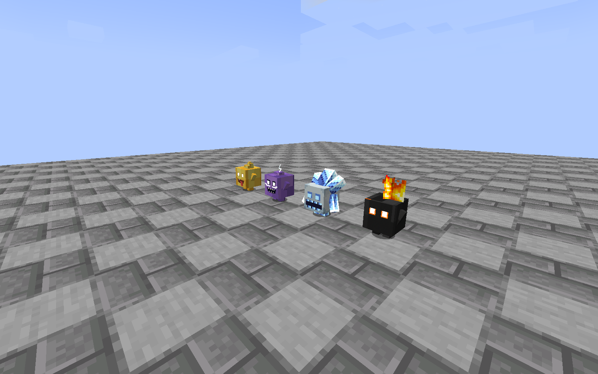
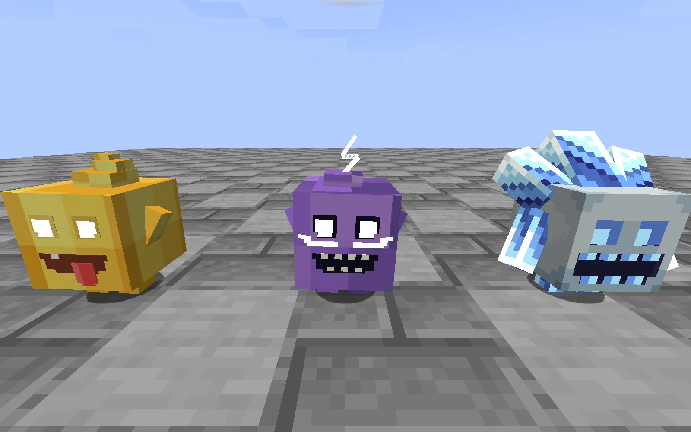
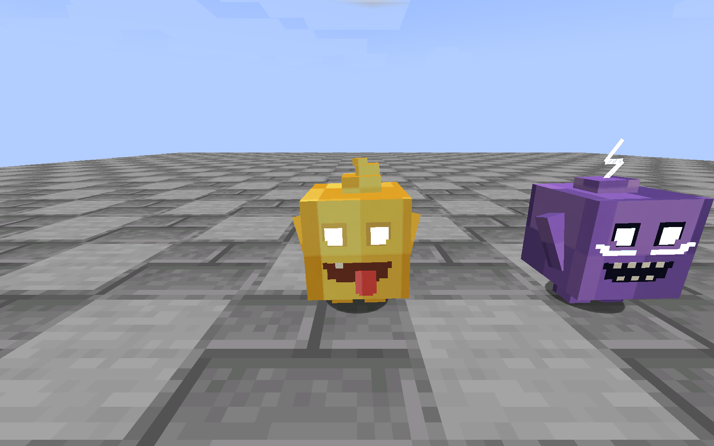
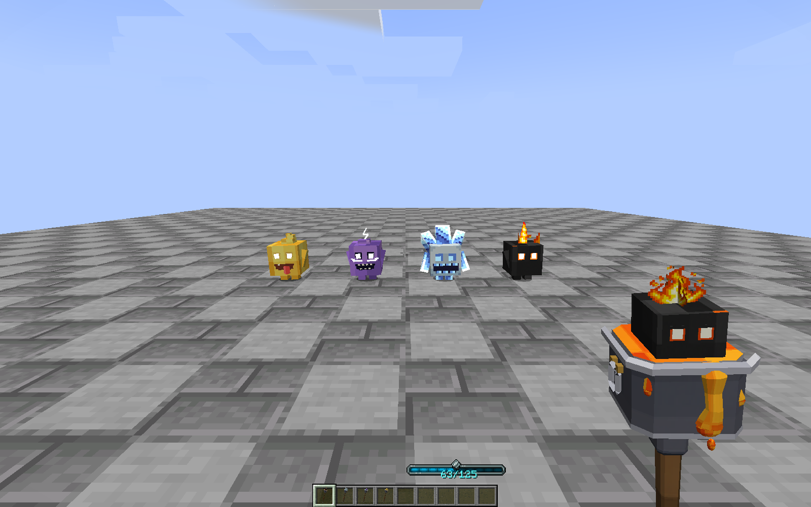
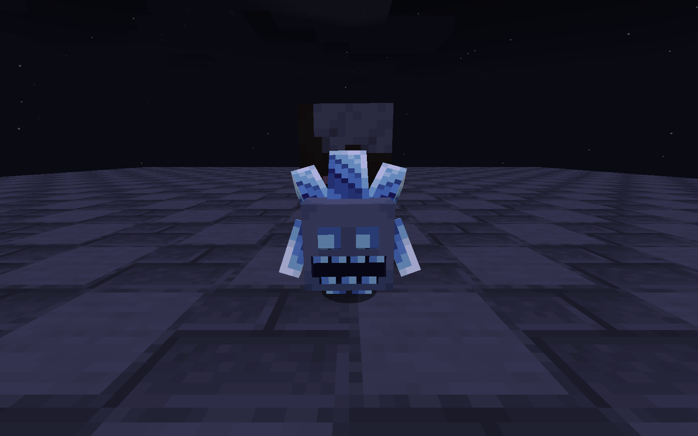

# 1.6.0-beta.3 本地模型验证

本版按用户要求仅保存在本地，未上传 GitHub，未替换实际 CurseForge 实例或用户世界。验证环境为 Minecraft 1.21.1、NeoForge 21.1.249、Java 21.0.12、Iron’s Spells 1.21.1-3.16.3。

## 本轮结果

- Gradle `build --no-daemon` 通过，生成运行 JAR 和 sources JAR。普通 `test` 任务显示 `NO-SOURCE`，不将其计为单元测试通过数。
- 8 份模型在实际 Blockbench 中保存、预览和导出，包含纹理，可直接编辑。运行时资源由这些 `.bbmodel` 导出；没有用另一套占位几何代替。
- 最终打包 JAR 在独立目录 `run-production-spirit-beta3-voxel` 启动，退出码 0，出现 `ROYALE_SPIRIT_CLIENT_COMPLETE models=4 leapFrames=10`。
- 截取 16 张 Minecraft 原始截图，检查四精灵近景、正侧面、四种法杖第一人称、第三人称、物品栏、真实跳跃和夜间冰精灵。
- 奶豆子、电豆子的实际轮廓为方块，五官为贴面方形和像素阶梯；不再出现先前圆球身体、突出眼球或深凹嘴。冰精灵沿用所提供的原模型及皮肤。
- 四种法杖均显示自身材质；最终日志没有本模组缺图、材质加载失败或 mipmap 降级警告。方块图集创建为 `2048x1024x4`，保留 4 级 mipmap。
- 火焰使用独立透明帧，没有之前加法混合造成的泛白矩形。跳扑捕获了 10 个同步姿态 tick；真实铁魔法施法召唤的火精灵命中目标，生命由 100 降至 92.3。
- 夜间截图可见冰精灵原遮罩的局部亮部，身体仍受环境光照；没有把整个主体设成满亮。

逐文件哈希、依赖和客户端 marker 见 [本轮证据 JSON](docs/beta3/test-results.json)。原始日志与构建日志放在同目录，完整 16 张截图在 [screenshots](docs/beta3/screenshots)。

## 实机图片











## 实际修复过的渲染故障

早一轮实机检查发现法杖为紫黑缺图：OBJ 引用了实体目录图片，但这些资源没有自动进入物品图集。现用显式 sprite source 注册。随后发现 627px 火焰帧会把整个方块图集降至 mip 0；现由 `FurnaceSpriteSource` 只在资源重载时创建 1024px 上传副本，保留磁盘上的 ImageGen 原 PNG。最终运行已确认图集回到 4 级。

火焰最初用 additive eyes 混合，透明像素中的 RGB 也会被加亮，出现泛白块；现改用 `entityTranslucentEmissive` 和独立 alpha 帧。以上问题均在最终截图之前修复。旧运行目录 `run-production-spirit-beta3-final` 的图片不作为当前版本成功证据。

## 证据边界

本轮重跑了模型与材质相关客户端检查、实际 JAR 加载和火精灵跳跃命中；没有重跑 Beta 2 的 59 个独立 GameTest 与 118 个铁魔法 GameTest，它们仍是 [前一轮机制证据](VALIDATION-1.6.0-beta.2.md)。本轮未改军团或精灵战斗数值。

测试采用固定依赖、自己的单人场景和无光影设置，不代表用户已认可造型，也不代替用户完整整合包、光影、多人延迟和长期平衡验证。原 MineClash 动画仅作研究，运行时采用本模组步态与同步跳扑，未声称完整移植 GeckoLib/Molang 动画。

日志有一条铁魔法自己的 `template_open_spell_book_model` 找不到模板模型警告；它不是本模组法杖资源，客户端完成了整个场景并正常保存退出，未在本次视觉修改中改动铁魔法资源。

## 交付

`royale-spells-neoforge-1.21.1-1.6.0-beta.3.jar`

```text
SHA-256 c5fec2a7d74ee91a58963426601104b498f327aa43537789fba5cb78823a0dcd
```

[八份模型的修改与导出说明](art/blockbench-v3/README.md)，[玩法与技术档案](docs/technical/11-furnace-staff-and-spirits.md)，[素材来源](SPIRIT-ASSET-SOURCES.json)。
