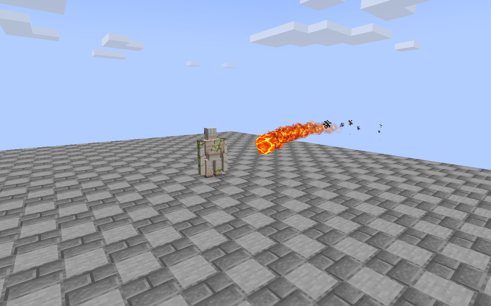
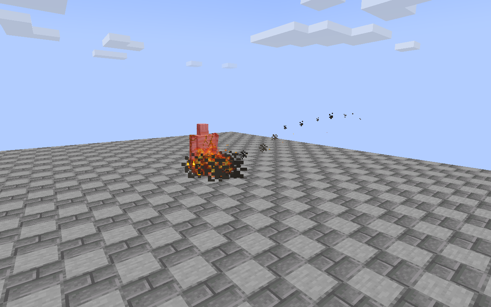
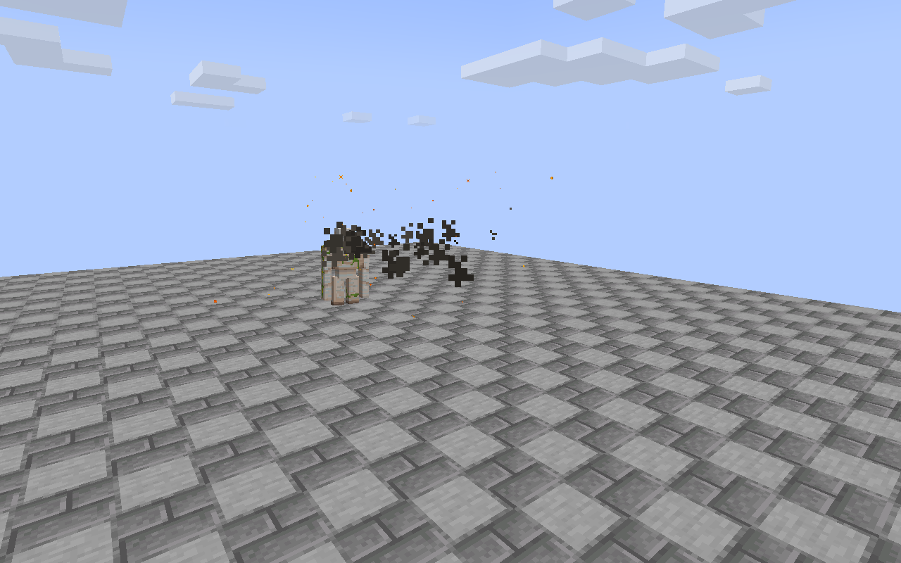
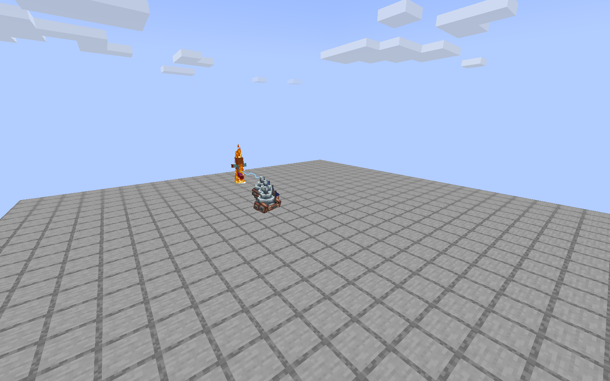
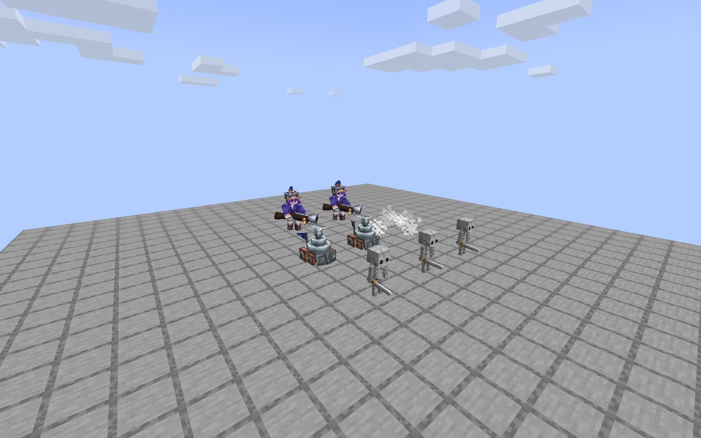

# Beta 3 验证记录

版本 `1.7.1-beta.3` 与电车附属 `0.1.1`，检查日期 2026-09-08。以 NeoForge 21.1.249、Java 21 为主要验证环境。

| 检查 | 结果 / 证据 |
| --- | --- |
| 本体独立 GameTest | 96 / 96；[XML](docs/validation-beta3/standalone.xml) |
| Iron 3.16.3、MineClash 0.7.5、电车 0.1.0 同装 | 162 / 162；[XML](docs/validation-beta3/joint.xml) |
| 电车 0.1.1 独立搭配 MineClash | 12 / 12；[XML](docs/validation-beta3/zappies.xml) |
| 本体 Beta 3 + 电车 0.1.1 + 实例其它模组的隔离客户端 | 实际游戏生成三车队、射击、暂停与恢复；[结构化报告](docs/validation-beta3/zappies-client.json) |

电车 0.1.0 → 0.1.1 的运行逻辑、攻击数值和混入不变，改动是版本／许可声明、公开编译依赖及说明。最终 0.1.1 JAR 经过独立测试和与本体同装的实际客户端验证。

完整施法测试检查：每波／每秒伤害的总和，结束后不再结算，雷电三个目标与范围边缘，卡牌和铁魔法生命周期、镜像 12 级、武器加成、卫队破盾、诅咒和小屋产兵来源、克隆、军团存档、精确雪球移速等。军团十五次同 tick 攻击基础总量 45，幽灵同样如此。卡牌火球三次命中 300 HP 铁傀儡，最终 223.55557，与 `300 - 3 × 688 / 27` 一致。

实际客户端电车三辆分别完成 7 / 5 / 6 次攻击，连续命中间隔全部为 46 tick。被电击的车和原生小骷髅有 9 帧姿态／动画时钟保持，附近未受影响实体继续动画；解除后续接。一次真正的攻击抬手在第 6 tick 暂停 10 个采样。死亡后存活车辆轮胎位置未继承死亡模型，攻击电弧在截图中可见。

## 画面证据

这些测试使用新建隔离存档，没有修改正式世界。实机检查使用发布候选的最终功能代码；其后仅补入两个复用现有图像的状态图标，完整发布 JAR 另做资源完整性检查。截图检查不是光影组合、长时间多人战斗、网络延迟或每种整合包的穷尽证明。此前 dev.6 的 Fabulous 检查保留为历史证据，不冒充本版最终 JAR 的全光影测试。

构建输出中的少量 Iron API 弃用警告仍存在，不是本次编译失败。基础数值和改编边界见 [卡牌换算表](CARD-BALANCE.md)。
