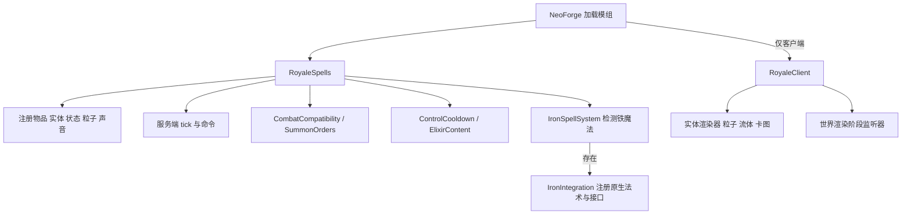
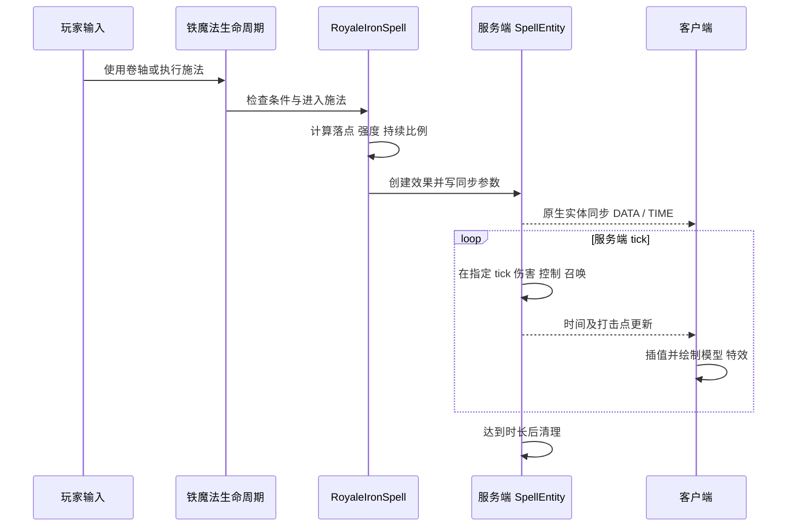

# 01 架构与执行边界

[返回目录](README.md)

## 1. 项目不是跨加载器公共模块工程

当前分支是一个 Java 21、NeoForge ModDevGradle 工程，只有一个 `src/main` 源集。客户端、服务端、可选铁魔法集成、GameTest 和视觉测试类都位于该源集中，通过加载器侧别、模组存在检查和测试开关区分执行路径。不能因为某个类在发布 JAR 中，就认为它会自动在普通游戏中运行。

其他 Minecraft / 加载器版本在独立 Git 分支中维护。修改本分支不会自动同步 Fabric，也不应直接把 NeoForge 的 Mixin 和映射名称复制过去。

## 2. 两种运行模式

| 项目 | 未安装铁魔法 | 安装铁魔法 |
| --- | --- | --- |
| 普通入口 | `SpellItem`、`TroopItem` 右键 | 原生卷轴、法术书、施法武器、附魔号角 |
| 资源 | `SpellEngine` 的独立圣水条 | 铁魔法 `MagicData` 魔力 |
| 卡牌限制 | 可正常使用旧卡牌 | 普通生存拒绝旧卡直施；创造和录制地图保留 |
| 数值来源 | `Spell` 与效果实体中的基础数值 | 同一效果加上 `IronSpellProfile`、等级和原生属性 |
| 冷却 | 独立施法间隔，控制法术另有共享池 | 原生冷却；控制池和军团限制另有持久化校验 |
| 新材料 | 有限流体、瓶子、桶 | 瓶子额外成为原生墨水的替代品 |
| 重油军团仪式 | 不执行 | 接入原生卷轴、号角和军团法术 |

`Spell.cost` 是独立圣水费用，不能拿来解释铁魔法法力消耗。也不能把独立模式的 `1.1` 镜像强化当成铁魔法镜像的等级加一。

## 3. 初始化顺序与职责

入口：[RoyaleSpells](../../src/main/java/dev/royalespells/RoyaleSpells.java)。构造时把注册、属性、指令和事件监听器挂到相应总线，再安装功能模块。

NeoForge 模组总线处理注册和客户端渲染器注册；游戏事件总线处理 tick、受伤、目标变化、玩家交互等。把同一个监听器注册两遍会造成重复伤害、重复声音或重复生成，排查时应从 `install()` 的调用次数开始。

## 4. 模块地图

| 区域 | 核心职责 | 主要入口 |
| --- | --- | --- |
| 根包 | 施法、目标筛选、轨迹、状态、声音、录制地图 | `SpellEngine`、`SpellMotion`、`ShowcaseMap` |
| `entity` | 服务端效果时序、召唤物、仪式、部署闪光 | `SpellEntity`、`ArmySkeleton`、`RitualEntity` |
| `iron` | 原生法术生命周期、镜像、卷轴材料、号角 | `RoyaleIronSpell`、`MirrorIronSpell`、`ArmyMagic` |
| `army` | 军团世界账本、阵型、声音、中立实验蛋 | `ArmyLedger`、`ArmyFormation` |
| `elixir` | 有限流体、打捞、天然来源、塔生成扩展 | `ElixirContent`、`TowerPools` |
| `client` | 纯视觉、预览、模型、GUI、视觉检查 | `TargetPreview`、`SpellFields`、`FrozenRender` |
| `mixin` | 原版及铁魔法没有直接事件入口的位置 | 详见 [Mixin 清单](08-data-and-mixins.md) |
| `test` | 服务端 GameTest | 详见 [测试章节](09-development-and-validation.md) |
| `resources` | 卡图、音轨、模型、语言、配方、标签 | 不把运行逻辑藏在说明文件中 |

## 5. 一次施法的端到端路径

镜像、军团和野蛮人小屋有专门分支，不是全部生成 `SpellEntity`。普通 `Spell.MIRROR` 本身没有有效的伤害效果，必须先解析被复制法术。

## 6. 权威与线程

- **服务端权威**：命中、伤害、控制、魔力、召唤限制、物品消耗、方块破坏、仪式输出。客户端的圈不授予施法权限。
- **客户端计算**：当前手持内容、未施法的落点预览、插值轨迹、粒子、程序几何、模型姿势、GUI。
- **同步**：实际效果通过原生实体跟踪与 `SynchedEntityData`；镜像上次法术使用一条服务端到客户端自定义消息；状态外观使用生物同步字节。
- 客户端消息处理用 `context.enqueueWork` 更新镜像预览状态。不得在网络解码回调里直接操作世界实体。
- 客户端视觉检查需要修改集成服务器世界时，通过服务器的 `execute` 调度；它们是测试入口，不是常规玩法接口。

## 7. 可选依赖隔离

`IronSpellSystem.loaded` 由 `ModList` 判断。公共边界方法使用 Minecraft 类型，避免在独立启动时立即解析铁魔法类。`CombatCompatibility.IronBridge` 也是延迟进入的内部实现。

这不是一层完全自动的可选依赖框架：部分 Mixin 通过 `@Pseudo`，部分通过 `RoyaleMixinPlugin` 判断是否启用；插件明确过滤的只有几个类，不能假定所有名字含 `Iron` 的 Mixin 都被统一过滤。增加对上游接口的引用后，必须同时跑“没有铁魔法”和“有完整铁魔法依赖”的启动与测试。

## 8. 当前架构的重要边界

1. `Spell` 的枚举序号用于效果同步和存档，重排会让旧效果读成另一种法术。新增时追加，迁移时显式处理旧格式。
2. 范围不是完全数据驱动：`Spell.radius`、`SpellEntity` 中的具体查询、视觉分支、召唤空间检查可能分别使用数值。只改枚举不保证全部同步。
3. 公共伤害工具与铁魔法伤害路径对原版受伤间隔的处理不同，见 [02](02-casting-and-balance.md)。
4. 运行时 `Map` 不等于持久化。军团和控制池有 `SavedData`；独立圣水条、部分位移与裂纹状态没有，见 [08](08-data-and-mixins.md)。
5. 公开类和静态字段目前主要供本模组内部使用，没有承诺为第三方提供稳定 API。
