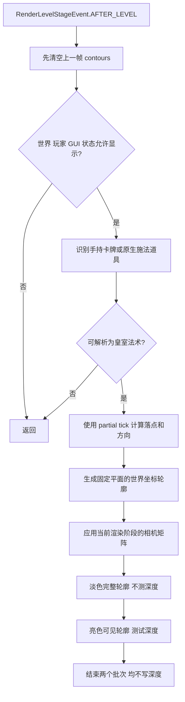

# 03 准星与落点预览渲染

[返回目录](README.md)

这是当前准星实现的完整阅读入口。核心文件：[TargetPreview](../../src/main/java/dev/royalespells/client/TargetPreview.java)、[TargetGeometry](../../src/main/java/dev/royalespells/TargetGeometry.java)、[IronClientPreview](../../src/main/java/dev/royalespells/client/IronClientPreview.java)、[SpellLayers](../../src/main/java/dev/royalespells/client/SpellLayers.java)、[RoyaleClient](../../src/main/java/dev/royalespells/client/RoyaleClient.java)。

## 1. 两层不同的东西

**屏幕中央的十字准星由 Minecraft 原生 HUD 绘制。** 本模组当前没有再画大号四角框，也没有把十字投影到树叶或台阶上。

本模组绘制的是世界坐标中的落点与范围轮廓：圆、滚动长条、双落点、觉醒小电双范围。它们有真实的世界尺寸，因此距离远时看起来小，低角度时圆投影为椭圆。这属于透视结果，不应通过强行保持屏幕像素大小来“修正”；需要修正的是世界半径变化、顶点高度乱跳、相机变换重复和遮挡错误。

## 2. 每帧的处理顺序



清空必须位于提前返回之前。否则玩家切到空手、打开菜单或 F1 隐藏界面后，测试缓存可能残留上次的形状；将来若复用缓存绘制，也会变成实际残影。

## 3. 显示条件与手持优先级

直接隐藏的条件：没有玩家、没有世界、`hideGui`、打开了 `screen`、旁观者。

识别步骤：

1. 优先主手旧卡牌；主手不是卡牌时再检查副手旧卡牌。`SpellItem` 对应法术，`TroopItem` 对应小屋。
2. 没有旧卡牌且装有铁魔法时，调用 `IronClientPreview.selected`。
3. 该函数按主手、副手检查附魔军团号角、一次性卷轴、带 `CASTING_IMPLEMENT` 的物品，或不要求装备的原生法术容器。
4. 容器使用其自身第一个法术；普通施法器使用 `ClientMagicData` 当前选择。遇到可施法手就停止继续寻找，即使其中是铁魔法原生法术，也不会绕到另一张皇室法术制造无关预览。
5. 铁魔法镜像通过服务端同步的历史 ID 解析被复制法术。若它是皇室法术则预览相应形状；原生铁魔法法术没有本模组专属范围预览。

只装备法术书、空手、普通道具都不会因为后台选中了皇室法术而显示圈。军团号角是显式例外，它自身可施法。

**边界：**此逻辑不是原生物品使用代码的完全复刻。双手同时持多种可施法物品时应做实际回归；当前旧卡牌优先于铁魔法选择。独立模式旧镜像卡没有原生镜像历史同步，不应声称该入口也能总是预览上一张卡的真实形状。

## 4. 落点射线与插值

每帧读取 `event.getPartialTick().getGameTimeDeltaPartialTick(false)`，并对眼睛位置、视线、玩家位置使用同一个 delta。

`SpellEngine.aim(player,32,delta)` 的处理：

- 从眼睛到沿视线 32 格的终点做方块检测，流体不是本次方块瞄准的独立目标。
- 在未被更近方块截断的距离内检测存活生物。命中生物时锚点取其位置；命中方块时抬高 0.07。
- 未命中时向下查找有限距离的碰撞表面。
- 预览锚点再抬高 0.05，以减少与表面共面时的闪烁。
- 潜行且选择狂暴、治疗、温暖、克隆时，预览锚点改为插值后的玩家位置。

不要把命中点换成屏幕中心坐标，也不要同时混用本 tick 的位置与另一帧的视线；两者都会表现为快速转头时预览落后、漂移。

## 5. 圆形的数学定义

圆心为 `C=(cx,cy,cz)`，半径为 r，分 64 段。第 i 个点：

```text
theta_i = i × 2π / 64, i = 0…64
P_i = (cx + r cos(theta_i), cy, cz + r sin(theta_i))
```

第 64 个点与第 0 个点闭合。每个点的 Y 都等于同一个 `cy`，因此任意水平距离都保持 r。

**不对每个圆周点分别调用 `ground()`。** 旧做法让树叶顶、低处草地和方块侧面成为不同的 Y，连线后便出现用户截图中的长条、尖角、阶梯和上下拉伸。现在只处理锚点高度，遮挡交给渲染层。

默认半径取 `Spell.radius`。小屋预览使用 1.6，军团使用 2.7；它们是部署提示，不是准确的建筑包围盒或每个士兵的碰撞检查结果。军团的每个单位仍单独落地并检查空间。

## 6. 长条滚动范围

滚木/滚桶不是把圆拉伸成椭圆，而是两个端部半圆加两条侧边组成的胶囊形。

```text
F = normalize(view.x, 0, view.z)
S = ground(playerPosition + 1.1 × F) + (0,0.08,0)
E = S + L × F
侧向量 = (F.z, 0, -F.x)
```

滚木 L=10，滚桶/英雄滚桶 L=5，r 取相应法术半径。两个半圆分别采样 24 段，并额外绘制 S→E 的中心线。形状沿施放方向旋转，所有预览顶点仍在起点平面。

该轮廓表示一个半径为 r 的伤害圆沿路径扫过的水平覆盖。实际滚动物体每 tick 仍会按当前位置寻找地面，并有目标高度限制，因此复杂地形上它不是一条能保证畅通或命中全部单位的导航预演。

## 7. 双范围与双落点

觉醒小电先绘制普通小电 r=2.2 的青色圈，再绘制第二击 r=3 的紫色圈。它们不是同一击的两条装饰边；对应服务端 tick 1 与 21 的不同查询半径。

觉醒飞桶：第二个落点为

```text
C2 = ground(C1 + 5 × (F × Up))
```

其中 Up=(0,1,0)。左右方向以代码中的叉乘为准，不要在客户端和服务端各写一个符号相反的偏移。两个落点分别有自己的平面高度，单个圆的内部顶点高度仍一致。客户端为显示抬高位置，服务端落地也有小高度偏移，因此比对时应区分显示偏移和水平误差。

## 8. 相机矩阵与绘制阶段

在当前 Minecraft / NeoForge 渲染流程中，`AFTER_PARTICLES`、`AFTER_ENTITIES` 与 `AFTER_LEVEL` 的 GPU 相机状态不同。公共辅助函数 `TargetPreview.matrices(event)` 只在 `AFTER_LEVEL` 把 `event.getModelViewMatrix()` 乘入新建的 `PoseStack`。

预览使用世界坐标顶点，随后调用：

```java
var matrices = TargetPreview.matrices(event);
matrices.translate(-camera.x, -camera.y, -camera.z);
```

世界点的相对位置是 `Pworld - CameraWorld`；已有游戏投影矩阵负责投影。这里的平移只做一次。在更早渲染阶段再次叠加已经位于 GPU 栈中的相机旋转，就会把效果转两遍，导致位置随转头异常变化。

`RoyaleClient.fields` 则处理效果实体局部坐标：矩阵平移为 `effectPosition - cameraPosition`，几何函数画局部点。不要把“世界坐标轮廓”和“局部实体几何”两种平移方案混用，否则会多减一次相机或多加一次实体位置。

第三人称时相机位置与玩家眼睛位置不同：目标应由玩家视线决定，观察矩阵应由当前相机决定。不能为了把圈强行放在屏幕中心而用相机替代玩家瞄准起点。

## 9. 两次绘制与透明深度

两层都使用 `POSITION_COLOR_NORMAL` 顶点格式、`LINES`、原生线条 shader、2.5 线宽、透明混合、关闭背面裁剪。

| 层 | 深度测试 | alpha | 深度写入 | 效果 |
| --- | --- | --- | --- | --- |
| `TARGET_GHOST` | 不测试 | 0.28 | 关闭 | 淡色完整轮廓，包括被地形挡住的部分 |
| `TARGET_VISIBLE` | `LEQUAL` | 0.9 | 关闭 | 正常可见部分更亮 |

先提交淡层，再提交亮层，各自 `endBatch(type)`。`RoyaleClient.line` 为两个端点写颜色和由线段方向得到的法线，不能只提交位置和颜色却保留含法线的顶点格式。

两层的 `COLOR_WRITE` 是关键：透明 alpha 并不自动阻止写深度。一张近乎透明的面若更新深度缓冲，之后画的玩家身体可能被它判定为“在后面”，出现斩首或模型缺块。范围层、领域透明层都禁止这种隐形遮挡。

淡轮廓故意允许透过地形，因此墙后看见一部分浅线是当前设计。它不更改服务端穿墙命中规则，也不会把世界深度清空。

## 10. 回归验证与诊断

已有 [TargetPreviewSmoke](../../src/main/java/dev/royalespells/client/TargetPreviewSmoke.java) 包含 14 场景：台阶远近左右、树冠侧视、FOV 100、第三人称、普通/觉醒小电、双飞桶、跨台阶滚木滚桶。

检查不仅看截图：

- 每条轮廓所有 Y 相等，容差 `1e-8`。
- 普通圆的水平半径与配置相等，容差 `1e-6`。
- 双桶确实有两个轮廓。
- 渲染前后逐像素比较整个深度缓冲，任何变化均失败。
- F1 和切换空手后清空预览。

这些是带图形上下文的可选检查，`glReadPixels` 会读取整幅深度缓冲，不可作为普通游戏逐帧诊断。开启方式、测试世界保护和原始记录见 [09](09-development-and-validation.md)。

| 现象 | 先查 |
| --- | --- |
| 只有快速转头能偶尔看到 | 渲染阶段、相机旋转是否叠加两遍 |
| 台阶/树叶上拉成锯齿或长条 | 是否重新加入了逐顶点贴地 |
| 近大远小、低视角椭圆 | 先验证世界半径；正常透视不应改为像素恒定 |
| 被圈遮掉模型 | RenderType 的写掩码是否含深度 |
| 切到普通物品仍显示 | 提前返回前是否清缓存、施法器选择条件 |
| 副手卷轴显示主书法术 | `preparedSpell` 容器优先级与当前施法手 |
| 预览有圈但放不出来 | 预览不负责魔力、冷却、世界边界和部署空间判定 |

## 11. 修改时的约束

保留当前圆、胶囊与双落点的数学定义；如需重新设计贴地投影，应作为独立视觉方案实现，并验证透视形状和真实范围。不要用压缩 Y、局部拉伸、固定像素半径或添加更大的中央框来掩盖矩阵错误。

修改 `Spell.radius` 时，还要检查 `SpellEntity` 的具体范围查询。当前不是所有法术都从枚举读取逻辑半径，视觉与机制必须分别核对。
