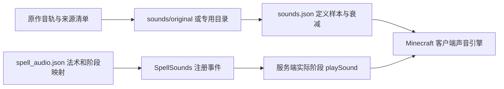

# 04 特效、模型、界面与音频

[返回目录](README.md)

## 1. 渲染调度

[RoyaleClient](../../src/main/java/dev/royalespells/client/RoyaleClient.java) 注册原生实体渲染器，并挂接三个世界阶段：

| 阶段/入口 | 工作 | 坐标约定 |
| --- | --- | --- |
| 原生实体渲染 | `SpellRenderer` 的投射物、滚木、箭雨、虚空；部队、仪式模型 | 调用者提供实体局部矩阵 |
| `AFTER_ENTITIES` | 非 `LivingEntityRenderer` 生物的冰壳/藤蔓覆盖 | 实体位置减当前相机位置 |
| `AFTER_PARTICLES` | `SpellFields`、觉醒部署几何；结束 `EFFECT` 批次 | 插值效果位置减相机位置 |
| `AFTER_LEVEL` | 未施法的落点预览 | 世界坐标顶点，见 [03](03-target-preview.md) |
| GUI / 物品渲染 | 铁魔法法术栏/轮盘、手持卡牌 | GUI 或物品显示矩阵 |

效果字段在 96 格范围内遍历 `entitiesForRendering`；`SpellEntity.shouldRenderAtSqrDistance` 另有 128 格判定。不同路径的距离条件并不完全相同，远处看到模型但看不到部分地面效果，应分别检查。

`SpellRenderer` 可能在实体阶段提交 `SpellLayers.EFFECT` 几何，随后在领域渲染结束处统一结束该批次。不要因为函数叫 `SpellFields` 就认为虚空等所有透明几何都只在这里产生。

## 2. 透明材质的状态约束

[SpellLayers](../../src/main/java/dev/royalespells/client/SpellLayers.java) 定义：

- `EFFECT`：位置+颜色的 QUADS，透明混合，`LEQUAL` 深度测试、`COLOR_WRITE`。
- `SPECTRAL`：使用骷髅纹理的半透明实体格式，只写颜色。
- `ARMY_GEAR`：正常可见的将军装备，允许写颜色和深度。
- `ARMY_GEAR_FADE`：装备消散时只写颜色。
- `TARGET_GHOST / TARGET_VISIBLE`：两层线框，只写颜色。

“禁止透明层写深度”适用于这些半透明覆盖层，不意味着所有实体装备都不能写深度。真实不透明装备需要正确遮挡。

新增顶点格式时，应完整提交所需的法线、UV、光照和 overlay；每次 `pushPose` 对应 `popPose`。优先通过 `RenderType` 声明和恢复状态。若直接使用 `RenderSystem`，保存并恢复实际修改的 shader、混合和深度状态，不能只把其中一个状态恢复成猜测的默认值。

## 3. 展开、维持与结束动画

[FieldAnimation](../../src/main/java/dev/royalespells/FieldAnimation.java) 提供确定性曲线：

```text
smooth(x) = clamp(x,0,1)² × (3 - 2 × clamp(x,0,1))
opening = 1 - (1 - clamp(time / openingTicks,0,1))³
opacity = smooth(time / 3) × smooth((duration - time) / closingTicks)
```

展开时长：狂暴 4 tick，虚空 10 tick，其余使用该函数的法术 12 tick。淡出时长：墓园 18 tick，狂暴 12 tick，其余 14 tick。虚空还在最后 14 tick 收缩，最多缩减当前半径的 28%。

这些曲线只改变外观，不缩小服务端实际命中范围。需要让展开过程也影响伤害时，必须另写服务端规则，不能从视觉半径推断命中。

## 4. 各类特效的实现位置

| 视觉 | 实现 | 与机制的连接 |
| --- | --- | --- |
| 小电下劈、分叉、电火花 | [ZapRenderer](../../src/main/java/dev/royalespells/client/ZapRenderer.java) | 读取服务端 `ZapPoints` 和 `TIME` |
| 虚空深色领域、热边、下劈 | [VoidRenderer](../../src/main/java/dev/royalespells/client/VoidRenderer.java) | 读取 `VoidStrikeTick/Strength/Points` |
| 毒药气泡与雾、诅咒、恢复、地震脉冲 | [AmbientSpellRenderer](../../src/main/java/dev/royalespells/client/AmbientSpellRenderer.java) | 以效果时间、种子和强度外观参数生成 |
| 墓园、狂暴渐变领域 | [SpellFields](../../src/main/java/dev/royalespells/client/SpellFields.java) | `FieldAnimation` 控制半径与透明度 |
| 紫色墓园漂浮粒子 | [GraveMoteParticle](../../src/main/java/dev/royalespells/client/GraveMoteParticle.java) | 客户端定期生成专用粒子，不使用末影人粒子替代 |
| 冰壳与实体藤蔓 | [SpellOverlays](../../src/main/java/dev/royalespells/client/SpellOverlays.java) | `VisualState` 标志控制 |
| 觉醒部署闪光 | [EvolutionBurstRenderer](../../src/main/java/dev/royalespells/client/EvolutionBurstRenderer.java) | 服务端成功部署后生成独立 `EvolutionBurst` |
| 重油仪式 | [RitualRenderer](../../src/main/java/dev/royalespells/client/RitualRenderer.java) | `RitualEntity` 的 AGE、MODE、DISPLAY |

### 小电

每次有效打击的视觉约 7 tick。主干由 13 段随机折线组成，先向地面生长，再显示亮芯、外晕、目标分支、地面扩散和漂浮碎火花。随机种子来自效果实体 ID、第二击标记与视觉帧，因此会动，但不会改变伤害目标。

服务端最多记录 16 个目标点，渲染最多连接其中 8 个，并忽略离局部中心过远的点。第二击从 tick 21 开始，外晕、分支和地面电弧使用紫色，半径也从 2.2 变为 3。视觉分支数不是伤害目标数限制。

### 虚空

使用无贴图几何和插值顶点颜色：暗酒红内部、绯红过渡、橙红热边、透明外晕；细小周期变化让边缘呼吸。每个服务端记录的受击点各自绘制自上而下的光束，按照当轮目标数量分档调整宽度。

渲染器使用世界受击点减去效果目标，转换为局部点。不能把生物当前位置在客户端重新当成服务端受击位置，否则移动中的目标会导致光束与伤害时刻不一致。

### 墓园和毒药

墓园粒子使用 `grave_mote.png`，来源记录在 [GRAVEYARD-PARTICLE-SOURCE.json](../../GRAVEYARD-PARTICLE-SOURCE.json)。每两个客户端 tick 按透明度概率生成两个粒子，半径按 `sqrt(random)` 采样，使面积分布较均匀。不要用线性半径采样造成中心密度异常。

毒药由低层橙黄区域、动态气泡/雾和少量着色尘埃共同构成；服务端每秒伤害一次与客户端每帧几何是不同频率。

## 5. 投射物方向与箭雨

[RocketMotion](../../src/main/java/dev/royalespells/RocketMotion.java) 定义火箭轨迹：

```text
position(p) = lerp(start,target,p) + (0, 6 sin(πp), 0)
tangent(p)  = target - start + (0, 6π cos(πp), 0)
```

模型鼻尖为局部 +Y，尾焰为 -Y，`rotation` 把鼻尖朝向归一化切线。尾焰位置沿同一方向后退 1.5 格。上升/下降方向来自轨迹导数，不是简单根据时间把模型突然翻转 180°。垂直发射在顶点速度趋零时有专门方向兜底。

[LogMotion](../../src/main/java/dev/royalespells/LogMotion.java) 先按行进方向确定横向轴，再按 `-distance / 0.72` 旋转。把滚动轴错写成竖直轴，会重新出现螺旋桨式旋转。

[ArrowPattern](../../src/main/java/dev/royalespells/ArrowPattern.java) 每波提供 48 个可见落点：16 个到达完整伤害半径，其余填充分布。视觉箭和服务器三波范围伤害分开实现；变更半径时二者必须同时检查。

## 6. 野蛮人、皇家卫队与小屋模型

实际运行时加载 [models/troop](../../src/main/resources/assets/royalespells/models/troop) 的 JSON，不直接读取 `.bbmodel`。[TroopModel](../../src/main/java/dev/royalespells/client/TroopModel.java) 解析 `parts` 层级，按父节点递归变换。

| 字段 | 含义 |
| --- | --- |
| `name / parent` | 部件标识和父节点；动画依赖 `head/right_arm/left_leg` 等名字 |
| `pivot / rotation` | 局部支点与静态欧拉角，rotation 为度 |
| `boxes` | 盒子或自定义四边形列表 |
| `from / size` | 盒子起点和尺寸 |
| `faces` | 自定义面顶点，单面 4 个点、12 个坐标 |
| `material` | 4×4 材质图集索引 |
| `color / flat / emissive` | 颜色乘数、局部平色采样、满亮绘制 |

几何单位为 1/16 格。每次动画准备先清零上次动态姿势，再计算行走、挥击、头部、披风等；共享模型不能留下上一只生物的状态。

野蛮人的剑通过原生 `ItemInHandLayer` 绘制，挂点在 `translateToHand`。它需要应用父骨骼，再补偿手持层的半转和掌心位置。之前武器嵌入胳膊的问题出在挂点变换，不能靠把整把剑变大修复。皇家卫队的可见装备主要在专用模型里，不能假定其每个装备槽都会经过野蛮人的手持层。

[art/make-troop-models.py](../../art/make-troop-models.py) 同时输出运行时 JSON 和可编辑 [Blockbench 模型](../../art/blockbench)。修改 `.bbmodel` 后不会自动更新运行时 JSON；维护时必须确认两个产物的一致性。

## 7. 骷髅与将军

[RoyaleSkeletonRenderer](../../src/main/java/dev/royalespells/client/RoyaleSkeletonRenderer.java) 使用 Minecraft 原生 SkeletonModel 和骷髅纹理，整体缩放 0.7。普通持剑使用原生手持变换；将军隐藏普通手持层，改用 [GeneralEquipment](../../src/main/java/dev/royalespells/client/GeneralEquipment.java) 的旗杖和装备。

头盔、护颊、发光眼睛、旗帜、盾和披风是程序方块几何。头盔由 [HelmetTaper](../../src/main/java/dev/royalespells/client/HelmetTaper.java) 在局部空间做轻微外扩；两眼与嘴部形成连通 T 字开口。眼部使用满亮光照，但这不意味着发出真实世界照明。

攻击动画依据服务端 STRIKE 进度计算蓄力与前刺；实际伤害时刻在约 44% 进度，不应把伤害改到动画起手时。旗帜为分段摆动的四组几何，盾仅在同步盾值大于 0 时显示。

## 8. 冰冻时锁定动画

仅停止移动或 AI，不会停止模型呼吸、摆臂和程序动画。[FrozenRender](../../src/main/java/dev/royalespells/client/FrozenRender.java) 为每个实体单独保存姿势，而不是冻结所有实体共享的 renderer/model。

流程：

1. 在生物渲染前进入 `Scope`，记录实际帧状态。
2. 冻结时临时应用已记录的帧、角度和动画参数。
3. 原版 `ModelPart`、`TroopModel`、GeckoLib 骨骼通过 `pose` 获得冻结变换。
4. 渲染结束 `close()` 恢复实体真实字段，下一只未冻结的生物继续正常动画。

缓存使用 `WeakHashMap<LivingEntity,State>`，骨骼使用身份映射；不能用实体类型作为键。GeckoLib 会绕开部分原版骨骼入口，因此需要独立 Mixin 路径。新渲染库若不经过这些路径，不应直接声称已支持动画冻结。

## 9. 染色、半透明与 GUI

`VisualState` 是服务端同步外观位。`SpellTint` 对实体格式的顶点颜色作乘数处理：克隆为青色且 alpha 约 0.32，冻结为冰蓝，狂暴为紫色。名字、阴影、拴绳和非实体顶点格式不应被一起染色。克隆还会选择透明渲染层；光有 alpha 值但使用不支持混合的层不能产生正确半透明。

[IronCardUi](../../src/main/java/dev/royalespells/client/IronCardUi.java) 只处理命名空间为 `royalespells` 且路径以 `textures/gui/spell_icons/` 开头的图标。

- 读取 PNG 实际宽高比，按固定高度计算宽度，避免原卡被压成正方形。
- 法术栏图标高度 22，轮盘 24；移除本模组卡图的重复背景框，保留原图自带框。
- 原生铁魔法图标走原来的 `blit`，不改变其边框。
- 重新绘制冷却覆盖，并用小标记表示选择。
- 曾经 `GuiGraphics.fill` 提前结束批次并改变混合状态，使之后原生边框不透明；当前选中标记直接绘制并恢复 shader。

这里对上游 GUI 的 UV、尺寸、调用顺序有耦合，升级铁魔法时必须测试混合排列。宽高比缓存目前没有显式资源重载失效处理，若资源包热替换成不同尺寸，需要单独验证。

旧实体卡牌由 [CardRenderer](../../src/main/java/dev/royalespells/client/CardRenderer.java) 直接绘制纹理，不进入地形图集；其平面宽高为 0.84:1。它与 `IronCardUi` 逐图读取比例是两条路径，不要误写成所有卡图都使用同一比例算法。

## 10. 声音数据链



[spell_audio.json](../../src/main/resources/assets/royalespells/spell_audio.json) 给每个法术配置 `deploy/travel/strike/impact/hit/summon/end/reroll/party/transform` 等实际需要的阶段；并非每个法术都必须有全部阶段。

[SpellSounds](../../src/main/java/dev/royalespells/SpellSounds.java) 启动时检查所有旧 `Spell` 至少有 deploy。阶段不存在时 `play` 静默跳过。每个 cue 的基础音量乘 0.90，事件固定传播范围 64；客户端样本的 `attenuation_distance` 也要匹配。仅增大服务器广播范围不能解决客户端早早听不到的问题。

普通法术声使用 `SoundSource.PLAYERS`。野蛮人有单独 `UnitSounds`，军团有 `ArmySounds`，不能通过改一处配置假设所有声音音量一起变化。野蛮人脚步至少间隔 8 tick、音量 0.12；攻击声只在成功攻击后播放。

重要时序：大闪 tick 2/8/14 按实际目标各响一次，取消初始统一 deploy；虚空 16/40/64 三次 strike，即使本轮无目标也有区域劈击声。原生 LightningBolt 设为 visualOnly/silent，并由 `SilentLightningMixin` 尊重静音，避免混入原版巨大雷声。

立体声音轨需要正确处理成单声道才能用于这套距离定位。素材导入工具与原始/产物哈希见 [SPELL-AUDIO-SOURCES.json](../../SPELL-AUDIO-SOURCES.json)、[ARMY-ASSET-SOURCES.json](../../ARMY-ASSET-SOURCES.json)、[ASSETS.md](../../ASSETS.md)。虚空劈击、将军破盾及部分活动法术存在复用音轨，不能写成已经获得所有角色的独立专属录音。
