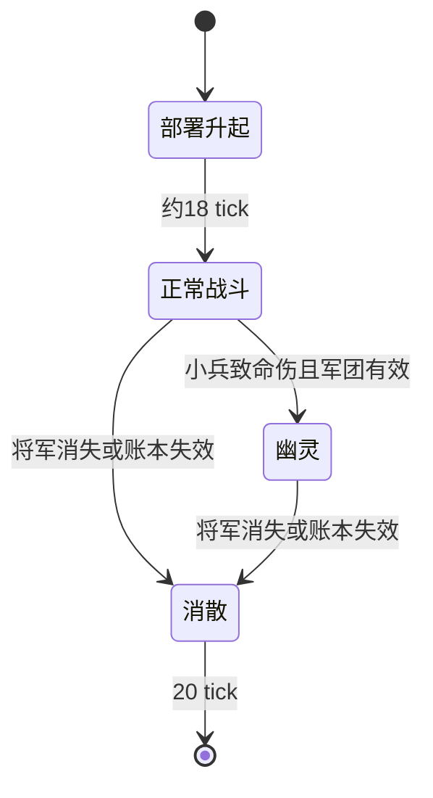

# 06 召唤物与战斗规则

[返回目录](README.md)

## 1. 所有权与生命周期

[Summoned](../../src/main/java/dev/royalespells/entity/Summoned.java) 是本模组召唤物的公共接口，提供主人、剩余生命周期初始化和克隆标志。当前实现类为 `AllyZombie`、`AllySkeleton`、`RoyaleUnit`，军团继承 `AllySkeleton`。

普通墓园骷髅默认 6 血、显式基础攻击 1.5、400 tick 生命周期；小僵尸常规 10 血，诱饵 3 血；野蛮人基础 20 血，皇家卫队 24 血；普通移动部队通常存活 600 tick。实际铁魔法强度和召唤事件可能改变属性。

召唤工具禁止捡物，装备掉落概率为 0，经验和战利品关闭。人形部队借用了僵尸逻辑基类，但野蛮人与皇家卫队的模型、声音及部分生理行为另有覆盖，不能把 Java 父类直接当成视觉身份。

## 2. 友方判断与可伤害目标

[CombatCompatibility](../../src/main/java/dev/royalespells/CombatCompatibility.java) 按以下方式识别主人：本模组 `Summoned` → 原版 `OwnableEntity` → 铁魔法 `IMagicSummon`。查找实体时优先当前维度，再查在线玩家表。

`SpellEngine.friendly` 包含同一个 UUID、同主人，以及主人/实体的原生队伍同盟关系。`enemy` 是存活、非旁观、非创造玩家且不属于友方的生物。

**法术伤害目标和召唤物主动攻击目标不一样。** 玩家可以主动把法术瞄准和平生物；部队不会因此默认猎杀所有和平生物。主动 AI 另由 `SummonOrders` 限制。

## 3. 部队目标优先级

[SummonOrders](../../src/main/java/dev/royalespells/SummonOrders.java) 每 5 tick 更新：

1. 玩家最近攻击指定目标：记录窗口 200 tick，部队距离不超过 32 格。
2. 若没有指定目标，允许保留 24 格内符合规则的当前目标。
3. 否则在半径 16 内找最近、可见且允许攻击的敌人。
4. 没有敌人时，离主人超过 6 格可尝试跟随。

允许目标包括最近伤害主人的生物、正在攻击主人/友军的生物，以及非中立、非其他玩家和平召唤物的 `Enemy`。未激怒的中立单位不会仅因属于某个敌对外观类而被追杀。

主人离线或无法解析时，不把原有部队变成无主猎杀者。中立实验军团使用专门标记和随机阵营 UUID，允许主动寻找敌方测试对象。同一支中立军团仍彼此友好。

事件层也约束铁魔法召唤物目标变化，但没有替换所有第三方 Boss 的 Brain 或技能状态机。`setTarget` 成功不等于每个复杂实体都会实际执行正确攻击。

## 4. 小骷髅速度与弱攻击

`SummonOrders.boostSkeleton` 对本模组小骷髅和原生铁魔法召唤骷髅加一个固定 ID 的永久速度修饰符：`royalespells:small_skeleton_speed`，乘算总值 +25%。已有同 ID 时不重复添加，防止保存重载后不断加速。

墓园小骷髅的剑是视觉装备，攻击直接使用属性基础值，不叠加原版石剑攻击加成。其 `doHurtTarget` 临时清除目标受伤间隔并在 finally 恢复，实现低伤快速攻击。

军团使用单独 `doHurtTarget` 和动画节奏，不自动继承墓园的穿受伤间隔机制。增加军团伤害或攻速必须一起检查伤害时刻和原版受伤间隔。

## 5. 无附带击退与显式位移

`CombatImpact` 用 `ThreadLocal<Deque<LivingEntity>>` 标记当前伤害调用要抑制附带击退的目标，finally 清理，支持嵌套调用。Mixin 在 `LivingEntity.knockback` 入口仅取消匹配目标。

小骷髅作为攻击者时，`LivingEntityMixin` 包装 hurt；原生召唤骷髅箭矢还通过 `SkeletonArrowImpactMixin` 取消箭的额外击退。军团小兵转为幽灵的致命一击也禁止击退。

[SpellMotion](../../src/main/java/dev/royalespells/SpellMotion.java) 保留法术显式位移。普通生物使用速度/推力并标记同步；`NoAI` 生物不会执行正常 travel，因此单独调用原生碰撞求解移动，推力最多持续 16 tick。每 tick 衰减水平速度并处理重力，不直接把生物穿墙传送。固定建筑小屋被排除。

这解释了早期飓风和雪球“对测试对象没有位移”：只设置速度不能保证 NoAI 目标真的移动。

## 6. 军团阵型与部署事务

[EvolvedArmySpell](../../src/main/java/dev/royalespells/iron/EvolvedArmySpell.java) 和 [ArmyFormation](../../src/main/java/dev/royalespells/army/ArmyFormation.java) 使用 15 名小兵+1 名将军。

将军在中心后方 `-1.25 × forward`；小兵为 5 列×3 排，间隔 0.85 格。每个位置单独 ground，检查区块、世界边界、交互权限和体积碰撞。预览圈不替代这 16 个检查。

正常部署先构造整组，建立 `ArmyLedger` 记录，再逐个加入世界；若加入失败，结束账本活动标记并丢弃已构造单位，避免留半支军团。账本 `finish` 保留原冷却值，因此不能把失败回滚描述成所有资源与 CD 都无条件恢复。

单位默认 `4 × P` 最大生命和 `1.8 × P` 攻击；将军额外盾值等于初始化生命值。寿命上限 12000 tick（正常速度 10 分钟）。军团基础冷却 300 tick，实际玩家有效 CD 由原生计算；即使 CD 到期，只要当前账本军团仍有效，也不能再召唤。

## 7. 将军、盾、幽灵和消散状态

将军盾在非绕过无敌伤害下先扣盾，破盾那次不把余量传给生命；仅从正盾降到 0 的一次播放破盾声。绕过无敌的伤害不受该分支保护。

小兵致命受伤时，若将军支持仍有效且伤害不绕过无敌，则恢复生命并变成紫色幽灵。幽灵拒绝普通伤害，不可作为常规攻击目标，不参与普通推动；它仍能攻击。将军不会走这个转化分支。

将军死亡或以会销毁实体的原因移除时，结束对应账本；区块卸载本身不等于军团死亡。成员发现账本不再有效后停止追击，20 tick 消散。

军团是否有效的权威是主世界账本的 Army UUID 与到期时间，不是“附近有没有扫描到将军实体”。这样不会因为将军暂时卸载，就允许同一玩家在另一个维度重复召唤。

## 8. 攻击动画与伤害时刻

军团 `STRIKE` 为同步攻击进度，`strikeTarget` 为服务端目标 UUID。部署前 18 tick 不攻击。开始攻击后，约在总时长 44% 时再次检查目标存活、距离和视线，再执行伤害。

正常将军动作 18 tick、小兵 16 tick；狂暴时分别 13/12。下一次起手间隔与动作时长分别管理。将军近战范围使用扩大的包围盒，小兵沿用普通近战判定。

存档保留军团年龄、盾、幽灵和消散状态，但没有持久化半次 STRIKE 与目标；重载不会保证从上一帧接着打出同一击。这属于当前实现边界。

## 9. 中立实验刷怪蛋

`royalespells:neutral_skeleton_army_spawn_egg` 调用 `ArmyFormation.neutral`。随机生成阵营与军团 UUID，不占玩家自己的限制或魔力，也不归某名玩家。中立路径仍使用账本维持将军支持关系，有碰撞检查和统一部署特效。

它不是普通玩家召唤的替代入口。要测试主人优先指令、联机 PVP 和号角 CD，应使用真正的原生法术入口。

## 10. 克隆

自己的普通召唤物通过 `SpellEngine.cloneAllies` 重建允许的实体种类，最大生命设为 1，持续 400 tick，复制相应攻击属性，取消吸收盾，不复制小屋或已克隆体。

[NativeClones](../../src/main/java/dev/royalespells/iron/NativeClones.java) 处理自己拥有的铁魔法 `IMagicSummon`：创建同类型、复制 NBT 后剔除 UUID、位置、速度、乘客、拴绳和状态列表，重设 UUID 与主人，注册到原生 SummonManager。保存 `RoyaleIronClone` 和到期 tick，关闭战利品与经验。

克隆原生召唤的 AI 和模型由原类型保留，但任意第三方实体私有 NBT 的复制安全性没有通用保证。不要把这套入口扩大成任意怪物克隆而不增加专门规则。

## 11. 野蛮人小屋

[RoyaleUnit](../../src/main/java/dev/royalespells/entity/RoyaleUnit.java) 目前只代表保留的小屋：无移动/观察目标、不可推动、锁定朝向，基础 65 血、生命周期 600 tick。

未眩晕时 `spawnClock++ % 300 == 0` 生成三只野蛮人，意味着第一波在开始时触发，再每 300 个可生产 tick 一波；不是先等 15 秒才出第一波。死亡/自然到期另生成一只，`deathSpawned` 防止重复。眩晕暂停生产计数，但生命周期仍推进。

保存 `SpawnClock`、`DeathSpawned`、`TroopPower` 和 `HutFacing`。子单位继承小屋强度与原生施法来源；修改镜像强化时不能只加强建筑血量而漏掉它生产的野蛮人。
