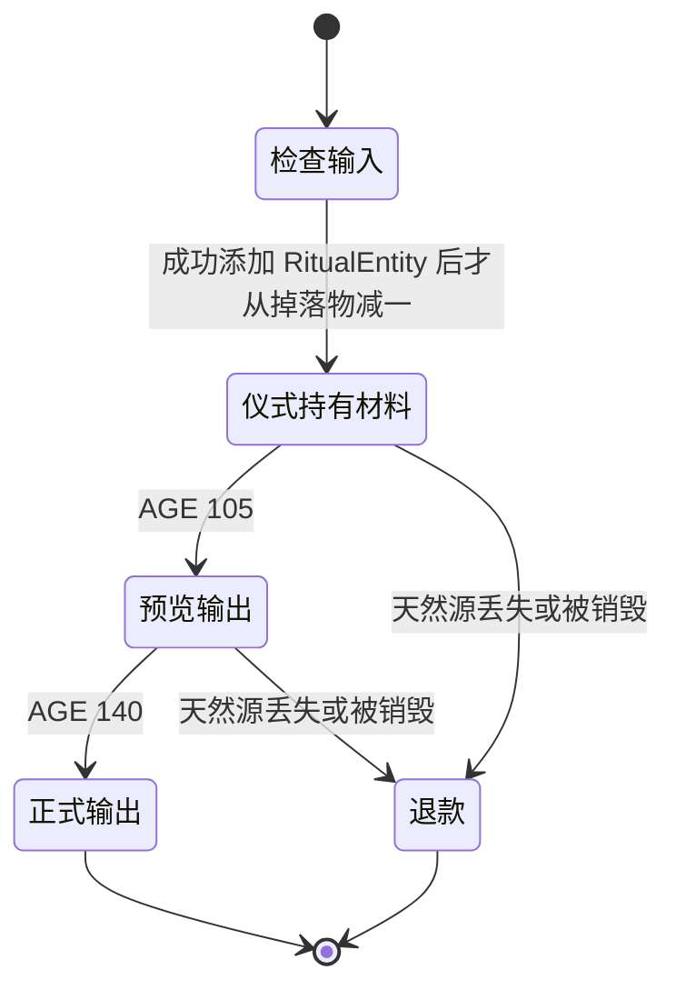

# 07 圣水、塔结构与重油仪式

[返回目录](README.md)

## 1. 两种有限流体

[ElixirContent](../../src/main/java/dev/royalespells/elixir/ElixirContent.java) 为圣水与暗黑重油分别注册 FluidType、源流体、流动流体、LiquidBlock 和桶。它们不是染色玻璃或水方块的别名。

| 项目 | 圣水 | 暗黑重油 |
| --- | --- | --- |
| 源流体 ID | `royalespells:elixir` | `royalespells:dark_elixir` |
| 流动 ID | `flowing_elixir` | `flowing_dark_elixir` |
| 方块 | `elixir_pool` | `dark_elixir_pool` |
| 桶 | `elixir_bucket` | `dark_elixir_bucket` |
| 密度 / 黏度 | 1100 / 1800 | 1600 / 4000 |
| 光照 | 6 | 2 |
| 流动 tick 间隔 | 15 | 35 |
| 无限源转换 | 关闭 | 关闭 |

两者 `slopeFindDistance=2`、`levelDecreasePerBlock=2`。客户端复用原生动态水纹并着色，见 [ElixirClient](../../src/main/java/dev/royalespells/client/ElixirClient.java)。

## 2. 打捞与搬运

手持玻璃瓶右键，用玩家当前方块交互距离执行 `SOURCE_ONLY` 流体射线。必须为源流体、允许交互且允许使用物品。服务端把该源方块变为空气，再用 `ItemUtils.createFilledResult` 处理玻璃瓶与产物。

一处源方块只装一瓶，不是拿同一池无限刷。流动液体不能装瓶；桶用于搬移源。创造模式的物品保留按原生 filled-result 语义处理，但该实现仍会移除被打捞的源。

## 3. 浓缩配方与墨水等级

全部浓缩为工作台无序配方，三个原料放三个格子：

| 原料 | 产物 | 对应原生墨水稀有度 |
| --- | --- | --- |
| 3×圣水瓶 | 1×罕见圣水 | UNCOMMON |
| 3×罕见圣水 | 1×稀有圣水 | RARE |
| 3×稀有圣水 | 1×史诗圣水 | EPIC |
| 3×史诗圣水 | 1×传说圣水 | LEGENDARY |
| 3×暗黑重油瓶 | 1×浓缩暗黑重油 | LEGENDARY |

普通圣水瓶为 COMMON，未经浓缩的暗黑重油瓶已经是 EPIC。由普通瓶开始计算，罕见/稀有/史诗/传说分别需要 3/9/27/81 瓶。配方确切 ID、条件和输出数见 [生成参数参考](spell-reference.md)。

同装铁魔法时瓶子继承 `InkItem`，grade 为 0…4；没装时是普通材料物品。瓶子能当墨水不代表桶也能放进墨水槽，更不代表消耗独立圣水条即可代替实体材料。

## 4. 卷轴制作与普通升级

[IronElixirForgeMixin](../../src/main/java/dev/royalespells/mixin/IronElixirForgeMixin.java) 在原生 ScrollForge 的结果生成处识别 `ElixirInkItem`，检查：

- 只允许 `RoyaleIronSpell`；原生铁魔法法术不能使用本模组材料替代墨水。
- 法术启用、允许制作、玩家满足制作条件。
- 有纸、有墨水替代瓶、有匹配法术实际学派的媒介。
- 材料 grade 不低于最低稀有度。
- 用 `getMinLevelForRarity` 求当前材料对应等级，结果必须在允许范围内。

客户端 ScrollForge 列表也过滤成皇室法术，但安全判定仍在服务端。仅从界面隐藏某项不足以实现配方限制。

奥术铁砧先走原生计算，本模组在结果阶段限制替代墨水只能用于皇室卷轴；普通升级、经验与材料取走逻辑继续由原生菜单处理。

## 5. 普通法术升级为觉醒

卷轴+浓缩暗黑重油，在奥术铁砧的输入槽 0、材料槽 1、结果槽 2 中处理。仅支持普通小电、普通巨大雪球、普通小僵尸飞桶到对应觉醒版本。

除了目标法术启用、允许制作、玩家满足条件，还受铁魔法 `SCROLL_MERGING` 开关控制。不会把任意皇室法术都变成一个虚构觉醒版。

等级按相对进度映射：

```text
newLevel = 1 + round((clamp(oldLevel,1,oldMax)-1) / max(1,oldMax-1) × (newMax-1))
```

例如 10 级普通法术对应 5 级觉醒的上限，不能直接把旧等级 10 写到最大 5 级的卷轴。输入复制一件后替换容器内容，保留物品其余合法组件。

## 6. 塔生成扩展

[TowerPoolsMixin](../../src/main/java/dev/royalespells/mixin/TowerPoolsMixin.java) 在 `StructureStart.placeInChunk` 的 TAIL 调用 [TowerPools](../../src/main/java/dev/royalespells/elixir/TowerPools.java)。只接受 `irons_spellbooks:pyromancer_tower`，不是所有名为巫师塔的第三方结构。

概率配置文件 `royalespells-worldgen.toml`，类型 COMMON：

```toml
elixirPoolChance = 0.65
darkElixirPoolChance = 0.35
```

范围均为 0…1。圣水设 1 也只是“地形合适时保证尝试”，找不到合法场地仍可能没有池。随机数由世界种子、结构起始区块和两种不同 salt 决定，逐区块调用不会重复掷出互相矛盾的结果。

### 地表圣水

从主塔四周偏移 5 格等候选点选位置，检查完整池在结构现有区块引用范围内、四角高差不超过 3、不低于海平面、不与原结构件相交。池衬为方解石，圆形外轮廓半径约 3，源区域为 `x²+z²<=4`。

### 深层重油

匹配原生 `pyromancer_tower/basement` 模板，在其局部坐标 `(5,-8,18)` 放源池。密室局部范围 x=1…9、z=13…23、y=-9…-3，深板岩外壳和照明柱，通过梯井连接原地下室。

模板局部坐标按结构件旋转转换为世界坐标，梯子朝向也旋转。所有写方块操作限定于当前 chunk clip，已有方块实体不会被覆盖。这些检查用于保护原容器与跨区块生成，但不代表任意上游模板变更后仍然安全；模板布局改变必须重新测量。

旧世界已经生成完的塔不会被普通探索自动回填。`/place structure` 是管理测试路径；随机种子、概率、模板和场地仍影响结果。

## 7. 天然重油不是位置白名单

[DarkPoolBlock](../../src/main/java/dev/royalespells/elixir/DarkPoolBlock.java) 的方块状态带 `natural` 布尔值，默认 false；世界生成写 true。判定必须同时满足该方块类型、natural=true、仍是源流体。

桶拿走再倒出的重油使用默认状态，所以不能把天然仪式资格搬到家里。瓶子只保留材料身份，也不保留天然来源。流出源头的流动液体不能触发仪式。

有管理员权限时可以通过方块状态命令人为设置 natural；该标志是生存玩法来源规则，不是对管理员操作的安全边界。

## 8. 仪式状态机

[ArmyMagic.itemTick](../../src/main/java/dev/royalespells/iron/ArmyMagic.java) 每 10 tick 检查掉落物是否进入自身位置或下方的天然源方块。满足 Y 高度和冷却保护后进入仪式。

| 模式 | 输入 | 输出 |
| --- | --- | --- |
| 0：转化 | 任意等级 `irons_spellbooks:raise_dead` 或 `royalespells:graveyard` 卷轴 | 1 级觉醒骷髅军团卷轴 |
| 1：融合 | 未附魔军团能力的山羊角+觉醒军团卷轴 | 原山羊角附上军团能力；消耗卷轴 |

模式 1 由号角寻找 2.5 范围内最近、同样处于天然源状态上的军团卷轴；附近已有仪式时不启动第二个重叠仪式。输入普通墓园卡牌、任意其他卷轴或一瓶重油不会触发。



## 9. 防丢失、重载和重复产物

[RitualEntity](../../src/main/java/dev/royalespells/entity/RitualEntity.java) 在服务器持有输入副本 first/second。先成功加入仪式实体，再各消耗一个原掉落物；堆叠剩余部分继续保留。

持续 140 tick（约 7 秒），105 tick 切换展示物品并播放号角提示，140 tick 产出。整个过程不消费天然源本身，但源被打捞、替换或不再天然时退款。

`settled` 防止重复输出/退款。退款物品有 200 tick `RoyaleRitualGrace`，避免立即掉回池里再次开始。区块卸载保存年龄、输入、模式、源位置、结算标记；销毁则尝试退款。

边界：产物 `addFreshEntity` 的失败不是一个完整数据库事务；强制取消掉落物生成的第三方监听器需单独验证。读取 NBT 时 DISPLAY 初始化为输入，若在 105 tick 后重载，展示物的切换不会保证完全接续旧视觉，但最终输出逻辑仍根据模式计算。不要把“保存输入不丢失”的测试扩大描述成所有视觉阶段无缝恢复。

## 10. 号角组件与施放

山羊角保留原物品副本，写：

- `CUSTOM_DATA.RoyaleSkeletonArmyHorn=true`；
- `INSTRUMENT` 指向 `royalespells:skeleton_army_horn`；
- `ENCHANTMENT_GLINT_OVERRIDE=true`。

这不是注册一个新的附魔类型。右键事件识别标记后拦截原使用流程，服务端校验原生法术与军团条件，再以 `CastSource.NONE` 调用军团法术。成功后开始使用物品、记统计和乐器游戏事件。号角不耗魔力，但军团存活限制与 CD 不被绕过。

## 11. 修改和验证要点

改变结构深度要一起检查局部坐标、四种旋转、梯井、上下边界和 chunk clip。改变配方要检查原生槽位、材料取走、等级映射、SCROLL_MERGING 和客户端列表。改变仪式要检查两种模式、堆叠输入、源丢失退款、保存重载、输出唯一性和号角旧组件保留。

相关 GameTest：`ElixirTests`、`ArmyTests`、`IronSpellSystemTests`。结构和仪式实际画面记录见 [Beta 验证](../../VALIDATION-1.5.2-beta.1.md)。
