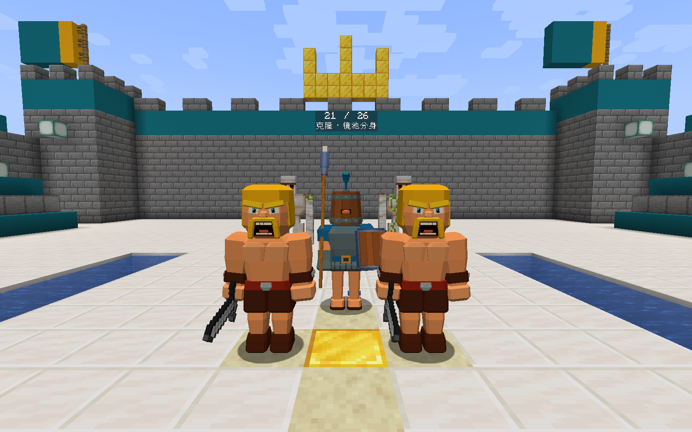
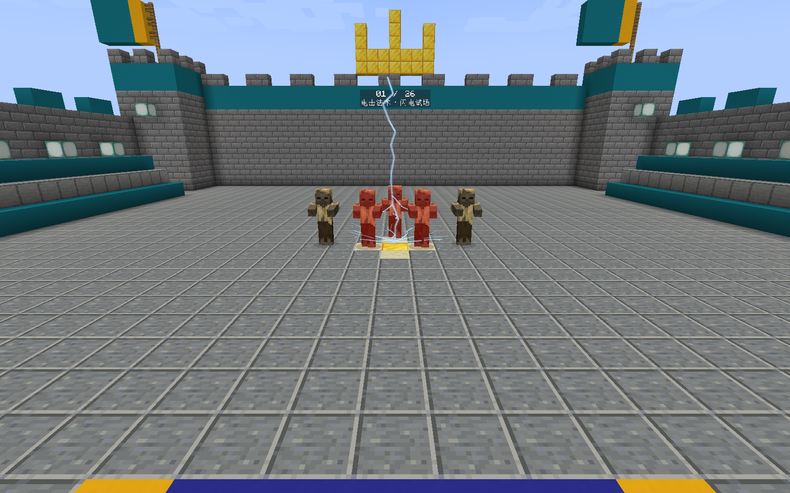
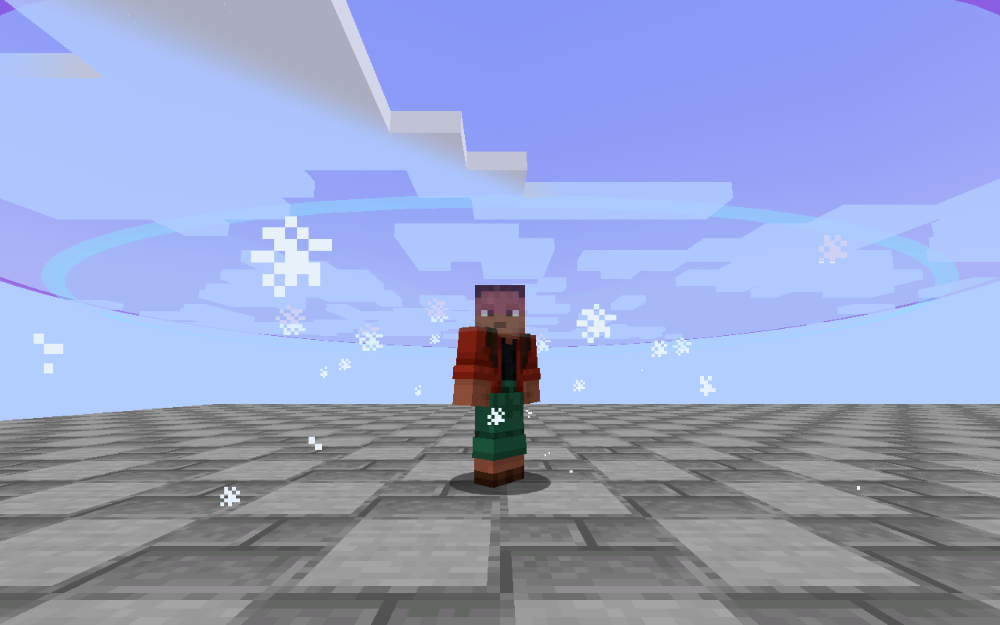

# 1.2.0 · Minecraft 1.21.1 Fabric 适配与验证

2026-09-06，在 Windows 上使用 Java 21.0.12、Minecraft 1.21.1、Fabric Loader 0.19.3 和 Fabric API 0.116.17+1.21.1 完成验证。本分支从 1.20.1 的 1.2.0 发布提交移植，保留原有卡牌、数值、已确认的模型和原版音效。

## 适配内容

- 使用 1.21.1 + Yarn 1.21.1+build.3，编译和运行要求 Java 21。
- 迁移实体数据追踪器、状态效果注册引用、属性修饰符、实体生成数据包和物品说明接口。
- 迁移顶点提交、模型 ARGB 颜色与客户端帧时间接口；范围透明层继续只写颜色，并保留深度测试。
- 29 项合成配方移到 `data/royalespells/recipe`，结果使用 `id` 字段；地震方块标签移到 `tags/block`。
- 使用新版注册表感知的地图持久化和文本序列化，生成独立的原生 1.21.1 地图。
- 针对 1.21 GameTest 的随机坐标与结构边界，给小屋测试建立足够大的空地，并确保雪球测试的整段弹道位于加载区块。保留原有伤害、位移、出兵数量和克隆排除断言。

接口迁移参考 [Fabric 1.21 / 1.21.1 官方更新说明](https://fabricmc.net/2024/05/31/121.html) 和当前 Yarn 映射中的签名。

## 已完成的游戏检查

- **36 项服务端 GameTest 全部通过。** 覆盖全部 28 张法术卡及配方、两段小电半径、镜像强化、克隆与归属存档、小屋出兵及到期、墓园近战、地震三轮累积与保留、关闭 AI 的目标位移及墙体碰撞、火箭弹道等。原始测试结果见 [GameTest XML](testing/gametest-1.21.1.xml)。
- **正式重映射 JAR 在 1.21.1 客户端成功加载并完成回归。** `runProductionVisual` 使用普通 Fabric 运行命名空间，完成模型、持剑及挥剑、冰壳、藤蔓、克隆／狂暴着色、小电和火箭升空／顶点／下落检查，已查看实际截图。
- **范围遮挡回归通过。** 绘制范围平面前后 4096 个 GPU 深度值一致；第三人称正反面截图中玩家模型保持完整。
- **音效检查通过。** 墓园原音频由游戏解码为单声道 3.0749 秒音频；15 条野蛮人音频全部解码。单独行走场景记录 5 次脚步、0 次攻击语音，脚步最大音量 0.12。
- **正式 JAR 生成并检查 26 场录制地图。** 每场通过真实客户端物品交互施法，测试上一场、下一场、首尾循环和潜行重置。普通雪球实际移动 3 个测试目标，飓风移动 8 个；这些是场景中的检测数量，不是法术目标上限。已查看小电连续帧、地震第二／第三轮、野蛮人正侧面握剑与木桶头卫队截图。
- **地图存档检查通过。** 原生 DataVersion 3955，9 个区域文件，三个标准原版维度；地图标记为完成并停在第一场，快捷栏第 1 格小电、第 8／9 格为前后场景控制。包内世界名称带 `MC 1.21.1`。

正式客户端视觉检查与地图检查使用同一 JAR，SHA-256：

```text
6d33d29a6fdb097c57c1bbbbdde4baf4bc8fb15ed9ad850fe03e81a0fa9a6f44
```







## 复现与范围

```powershell
./gradlew.bat build
./gradlew.bat runGametest
./gradlew.bat runProductionVisual
./gradlew.bat runProductionShowcase
python tools/validate-recording-save.py "run-production-showcase/saves/生成的世界目录"
```

两个正式客户端任务在工程自己的独立目录创建新世界，完成后自动退出；需要可用的图形和音频环境。普通游戏不会启用这些流程。

本次使用本模组与 Fabric API 的独立 1.21.1 环境，没有打开用户已有存档。未验证 1.21.1 的第三方整合包、Sodium／Iris／光影包或远程多人环境；旧的 `validation-1.2.0.md` 中整合包检查仅属于 1.20.1 版。地图场景控制适合单人录制，多人共享当前场景。地震进度用于短暂接续施法，不改变原版工具挖掘速度。
