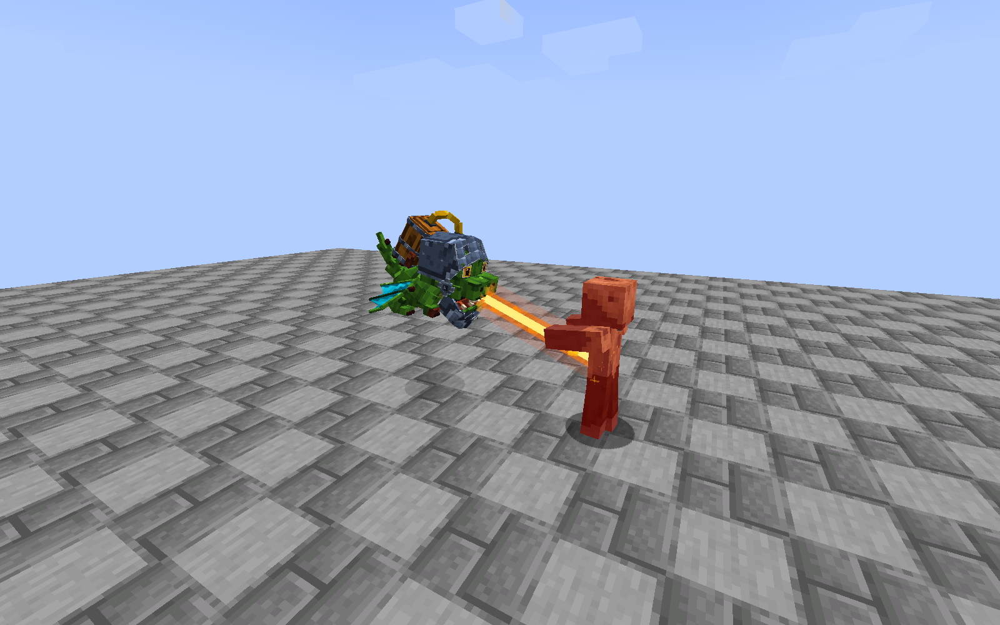

# 地狱飞龙 · 本地验证

最终成品：`royale-spells-neoforge-1.21.1-1.7.0-dev.1.jar`，SHA-256：`80e5ec41683085ad6d2fa9521f1dac6671d371b097af54514e6ea072947e62c7`。

独立 GameTest **79/79**，铁魔法同装 **140/140**，零失败、零跳过。两套包含重复公共用例。

独立生产客户端加载了与交付文件哈希一致的 JAR，完成原生卷轴召唤、前/下/后方模型检查、三档光束、冻结停止、恢复、实体移除后的声音清理。三个原作声音均有 OpenAL source 事件；喷射循环最多一个，结束后为零。游戏正常保存退出，未改动用户实例。

[正面](inferno-front-hover.png) · [翼腹](inferno-lower-wings.png) · [背部管路](inferno-back-tank.png) · [低温](inferno-beam-low.png) · [中温](inferno-beam-medium.png) · [冻结](inferno-frozen-beam-stopped.png) · [恢复](inferno-resumed.png)

[结构化记录](verification.json) · [客户端事件](client-checks.txt) · [独立测试报告](standalone-gametest.xml) · [铁魔法测试报告](iron-gametest.xml)

技术边界：未测试用户全量整合包、所有光影或多人延迟。客户端日志有铁魔法自身 `template_open_spell_book_model` 缺失模型警告，未阻止资源加载、召唤、动画或声音测试；本次没有改写铁魔法资源。
